# GESTALT — Grown Spacecraft & Habitats

**A conceptual design program for living, grown-from-a-seed spacecraft and habitats** —
biocomposite hulls, photosynthesizing interiors, and a gated, mostly-fundable ground
program to find out, cheaply and honestly, whether any of it can actually be built.

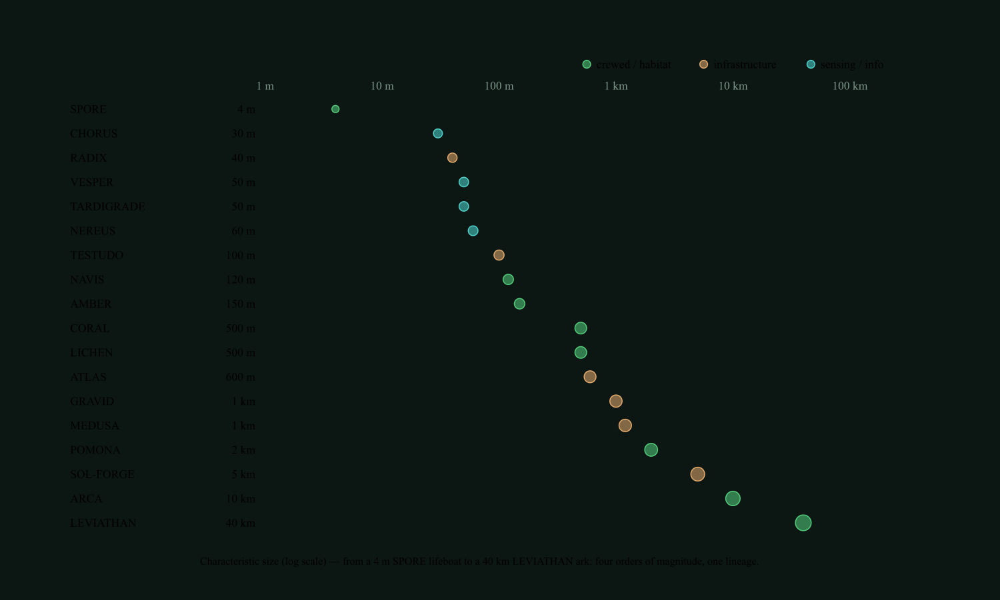

*One lineage, four orders of magnitude: every vessel in the fleet, drawn to a common log scale — a 4 m SPORE lifeboat through the 120 m NAVIS starship to a 40 km LEVIATHAN ark. Colour marks role: green = crewed/habitat, amber = infrastructure, cyan = sensing/info.*

> **Everything here is a concept study, not flight hardware.** Where the science is real
> it is marked and cited; where it is a bet, the bet is named. Every quantitative claim is
> grounded in a Python calculation and, increasingly, tied to a real published source.
> In the figures, **green = genuinely living/real science** and an explicit **`gap:`** flags
> what is unproven.

---

## Contents

- [The idea in one figure](#the-idea-in-one-figure)
- [Program map](#program-map)
- [The ten documents](#the-ten-documents)
- [The living starship](#the-living-starship) · [Worlds you live inside](#worlds-you-live-inside) · [The nursery](#the-nursery-that-grows-the-fleet)
- [The fleet](#the-fleet) · [The science](#the-science) · [Building it on Earth](#building-it-on-earth) · [See them in 3D](#see-them-in-3d)
- [By the numbers](#by-the-numbers)
- [Honest by construction](#honest-by-construction)
- [SEEDFALL — play the programme](#seedfall--play-the-programme)
- [Run the viewer](#run-the-viewer) · [Project structure](#project-structure)

---

## The idea in one figure

A GESTALT vessel is not built and then filled with life — it *is* the life. The hull is a
living tissue stack, grown like bark, bone and wood, with a photosynthetic skin on the
inside that makes the crew's air. Read from the vacuum inward:

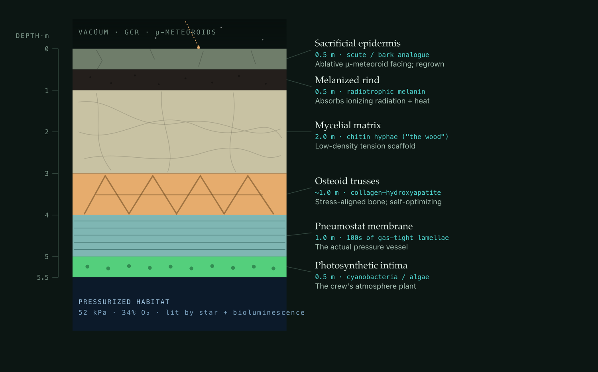

*Six grown layers over ~5.5 m: a sacrificial epidermis that ablates micrometeoroids, a radiotrophic melanin rind, a low-density mycelial tension scaffold, stress-aligned osteoid trusses, the gas-tight pneumostat membrane that is the actual pressure vessel, and the photosynthetic intima — the crew's atmosphere plant — enclosing a 52 kPa, 34% O₂ habitat.*

The whole organism runs a closed loop: light in, the intima trades the crew's carbon
dioxide and waste back for oxygen and food.


```mermaid
flowchart LR
  LIGHT(["☀️ star / piped light"]) --> INTIMA["🟢 photosynthetic intima"]
  INTIMA -- "O₂ + food" --> CREW["🧑‍🚀 crew"]
  CREW -- "CO₂ + waste" --> INTIMA
```

---

## Program map

The program is one lineage told at ten levels of zoom. A single engineered **seed** is
gestated by the **GRAVID** nursery into any class of vessel; the **Compendium** is the
science that all of it must obey, and the **Earth Program** is how you would actually find
out — on the ground, cheaply, with go/no-go gates.

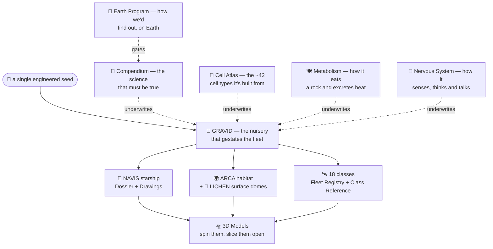
```mermaid
flowchart TD
  SEED(["🌱 a single engineered seed"]) --> GRAVID["🥚 GRAVID — the nursery<br/>that gestates the fleet"]
  GRAVID --> NAVIS["🌱 NAVIS starship<br/>Dossier + Drawings"]
  GRAVID --> ARCA["🌍 ARCA habitat<br/>+ 🍄 LICHEN surface domes"]
  GRAVID --> MORE["🛰️ 18 classes<br/>Fleet Registry + Class Reference"]
  SCI["🧬 Compendium — the science<br/>that must be true"] -. underwrites .-> GRAVID
  CELLS["🔬 Cell Atlas — the ~42<br/>cell types it's built from"] -. underwrites .-> GRAVID
  METAB["🍽️ Metabolism — how it eats<br/>a rock and excretes heat"] -. underwrites .-> GRAVID
  NERV["🧠 Nervous System — how it<br/>senses, thinks and talks"] -. underwrites .-> GRAVID
  EARTH["🌿 Earth Program — how we'd<br/>find out, on Earth"] -. gates .-> SCI
  NAVIS --> V3D["🛸 3D Models<br/>spin them, slice them open"]
  ARCA --> V3D
  MORE --> V3D
```

---

## The thirteen documents

Each document is a self-contained web page and shares one navigation bar linking the whole
set. **Open** goes to the live, interactive document; **Source** is the HTML in this repo.

| # | Document | What it is | Links |
|--:|---|---|---|
| 1 | **Design Dossier** | The living starship: anatomy, closed-loop metabolism, defenses, growth curve, bioengineering roadmap — 18 citations. | [Open](https://claude.ai/code/artifact/285ef29f-751e-4767-b5a6-9cd178faddb1) · [Source](docs/gestalt.html) |
| 2 | **Starship Drawings** | Architectural drawing set of the 120 m grown vessel: elevation, sections A/B/C. | [Open](https://claude.ai/code/artifact/bd2c2c98-84cf-42c9-91ea-f0ec1c749fc5) · [Source](docs/gestalt-drawings.html) |
| 3 | **Habitat · ARCA** | The million-person spin-gravity drum: sections, biomes, life-support budget. | [Open](https://claude.ai/code/artifact/9b90d7e5-2a71-426a-b2bf-d3a96b32a82e) · [Source](docs/gestalt-habitat.html) |
| 4 | **LICHEN** | A settlement grown into Moon/Mars regolith: dome anatomy, perchlorate → O₂ chemistry. | [Open](https://claude.ai/code/artifact/94531439-d04d-480e-9d04-bad6fcdacd9a) · [Source](docs/gestalt-lichen.html) |
| 5 | **GRAVID** | The nursery organism that gestates the fleet from seeds. | [Open](https://claude.ai/code/artifact/2433fa54-e582-4194-8245-d63acee8fb85) · [Source](docs/gestalt-gravid.html) |
| 6 | **Fleet Registry** | Vehicle classes, a readiness scorecard, and the containment regime. | [Open](https://claude.ai/code/artifact/7eeb70c7-e076-4b0d-b6e3-9e942c4d1091) · [Source](docs/gestalt-fleet.html) |
| 7 | **Fleet Class Reference** | A detailed profile of every one of the 18 classes + a comparison table. | [Open](https://claude.ai/code/artifact/7ca9c965-1932-4c5a-b0f1-a99e9febae58) · [Source](docs/gestalt-classref.html) |
| 8 | **Compendium** | The deep technical reference: organisms, circuits, materials, metabolism, defenses, biomining — 20+ citations. | [Open](https://claude.ai/code/artifact/d619e9af-9787-4d1b-8f1c-5a658789e075) · [Source](docs/gestalt-compendium.html) |
| 9 | **Cell Atlas** | Cytology of a grown vessel: all ~42 cell types across 8 classes — roles, survival, coordination, distribution, life-cycle, nutrition, and how they'd be engineered, grown & tested. | [Open](https://claude.ai/code/artifact/c6dd460f-700a-4b98-820a-0f75b0b1d973) · [Source](docs/gestalt-cells.html) |
| 10 | **Metabolism** | How the vessel ingests rock & light, digests, metabolises and excretes — with a mass-and-energy budget showing it *eats the rock* to grow, and photosynthesises only to breathe. | [Open](https://claude.ai/code/artifact/30f6d8bd-2623-4369-8709-9fa6d7c47444) · [Source](docs/gestalt-metabolism.html) |
| 11 | **Nervous System** | How it senses, thinks, controls and communicates — a hybrid "cyborg" of a grown wet nervous system, grown neural computation, and a fabricated silicon core joined by a bio-electronic interface. | [Open](https://claude.ai/code/artifact/d17aa4f1-9546-40a1-ad63-425e94099adc) · [Source](docs/gestalt-nervous.html) |
| 12 | **Earth Program** | The ground R&D roadmap: TRL ladder, six work packages, a 40-year Gantt with budget, gated go/no-go. | [Open](https://claude.ai/code/artifact/bc243583-d959-4284-841a-70ab529d40ed) · [Source](docs/gestalt-earthprogram.html) |
| 13 | **3D Models** | Interactive, rotatable/zoomable solid models of all seven main forms, with detailed cutaway interiors. | [Open](https://claude.ai/code/artifact/1c6f18ca-eeda-4d83-bd97-fd9c1622823d) · [Source](docs/gestalt-3d.html) |

---

## The living starship

The flagship is **NAVIS** — a crewed explorer grown as a 120 m × 50 m prolate spheroid of
~24,000 tonnes, crew of 50. The [Design Dossier](docs/gestalt.html) sets out its anatomy,
metabolism and defenses; the [Starship Drawings](docs/gestalt-drawings.html) give it a
proper architectural treatment.

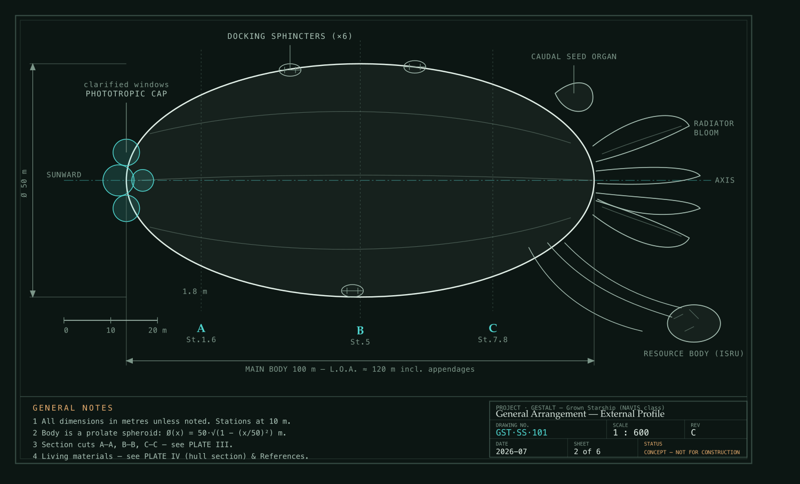

*General arrangement (GST·SS·101): the prolate-spheroid hull with its equatorial ring of six docking sphincters, a forward phototropic cap of clarified windows aimed sunward, and — aft — a radiator bloom, a caudal seed organ, and a mining root reaching to a resource body. Body 100 m; ≈120 m including appendages.*

You cannot grow 24,000 tonnes overnight. Biology *could* deposit that mass in ~1.5 years,
but mining and transport set the real ceiling — so the ship grows on a capped-rate plateau,
not an exponential runaway:

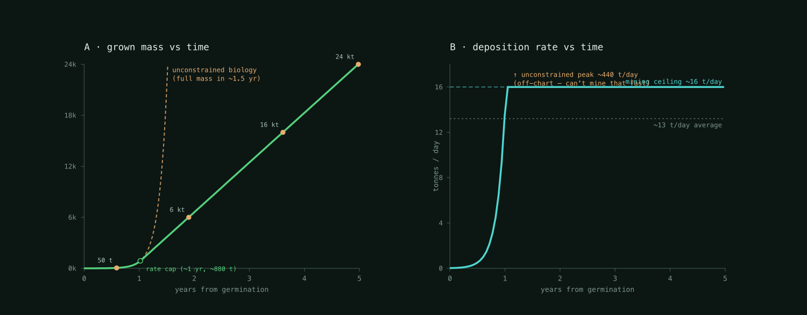

*Left: cumulative grown mass reaching ~24,000 t over ~5 years (~13 t/day average). Right: deposition rate is held at a ~16 t/day mining ceiling — the unconstrained biological peak of ~440 t/day is off-chart and simply cannot be fed that fast.*

---

## Worlds you live inside

Two documents scale the idea up to places people live. **ARCA** is a grown O'Neill drum for
a million people; **LICHEN** grows a pressurised settlement down into planetary regolith.

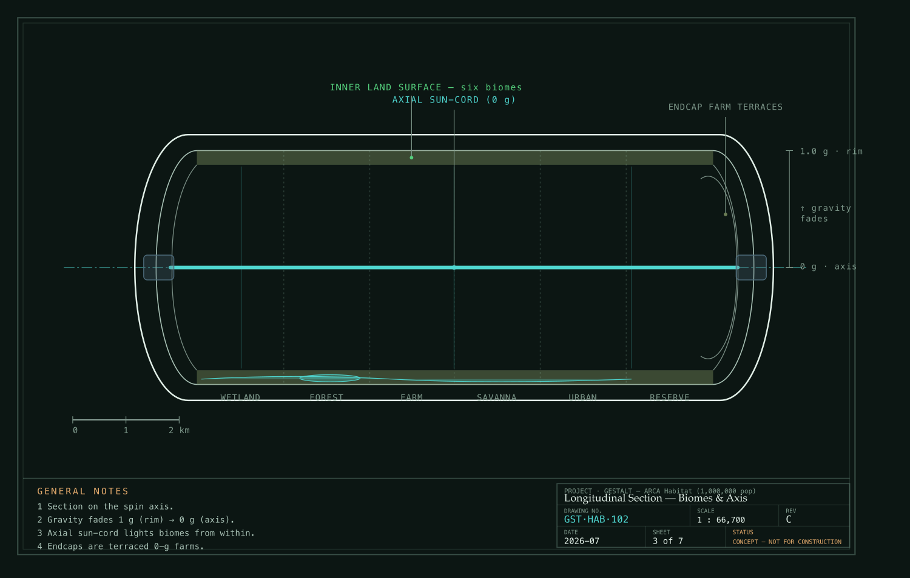

*ARCA (GST·HAB·102): a 5 km × 10 km spin-drum turning at 0.6 rpm for 1.0 g at the rim. You live on the inner surface across six biomes; an axial sun-cord lights them from within at 0 g, and the endcaps are terraced zero-g farms. Gravity fades smoothly from 1 g at the rim to 0 g on the axis.*

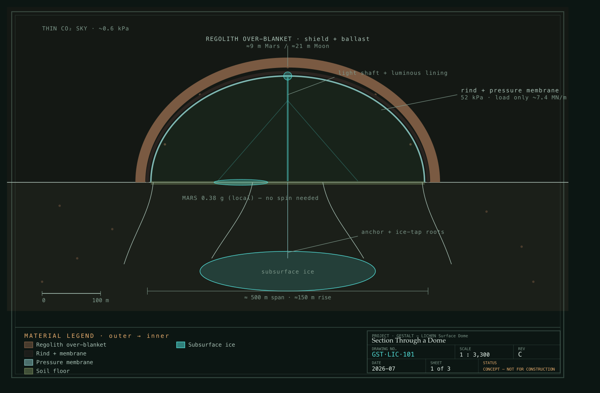

*LICHEN (GST·LIC·101): a ~500 m-span, ~150 m-rise pressure blister at 52 kPa, buried under a regolith over-blanket (~9 m on Mars, ~21 m on the Moon) that provides both shielding and the ballast that balances the internal pressure. Roots anchor it to bedrock and tap subsurface ice.*

---

## The nursery that grows the fleet

Nothing in the fleet is manufactured — it is **gestated**. [GRAVID](docs/gestalt-gravid.html)
is a nursery-shipyard organism: cradles bud from a central feedstock spine, each growing a
vessel from a seed and releasing it from a de-spun dock.

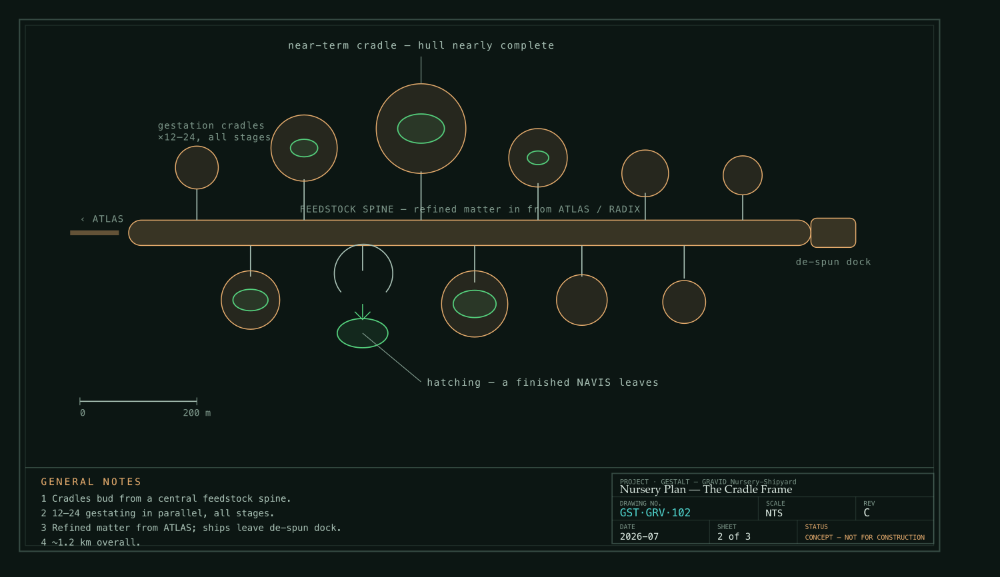

*GRAVID (GST·GRV·102): 12–24 cradles gestate in parallel at all stages along a ~1.2 km feedstock spine fed by mining tenders; a near-term cradle holds a nearly-complete hull, and a finished NAVIS hatches from the de-spun dock. Controlled feeding roughly halves wild gestation, to ~2–3 years per ship.*

---

## The fleet

From that one nursery comes a whole ecosystem of grown vehicles — 18 classes, catalogued in
the [Fleet Registry](docs/gestalt-fleet.html) with per-class detail in the
[Class Reference](docs/gestalt-classref.html). The [hero image](#gestalt--grown-spacecraft--habitats)
at the top of this page shows them all to scale.

The fleet's hard limit is not structure but **light** — the interiors are photosynthetic, so
range is set by how far sunlight can still feed them:

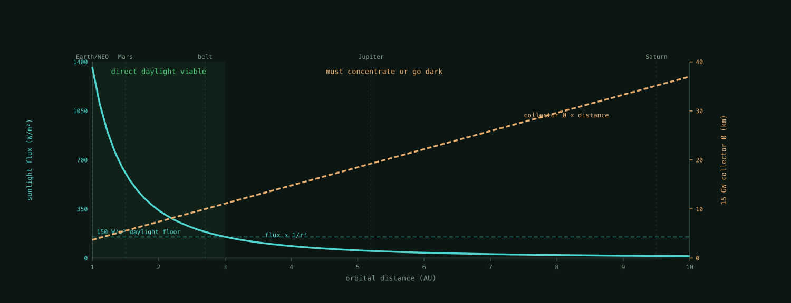

*Solar flux falls as 1/r² and drops below the ~150 W/m² daylight floor the intima needs past ~3 AU — which is exactly why deep-space classes must carry piped or stored light, and why the sunward inner system is the fleet's natural habitat.*

---

## The science

The [Compendium](docs/gestalt-compendium.html) is where the concept has to survive contact
with real biology and physics. Four of its figures:

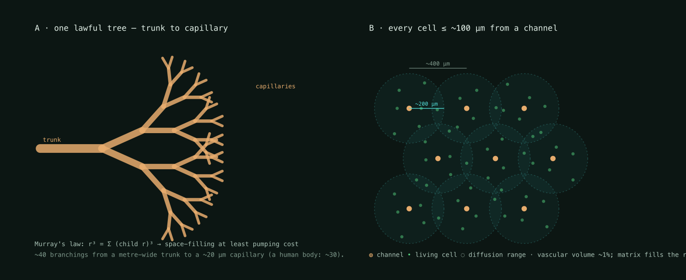

*Keeping metres of hull alive like bone and wood: a space-filling vascular tree obeying Murray's law (r³ = Σ child r³) branches from a metre-wide trunk to ~20 µm capillaries, so every living cell sits within a ~100–200 µm diffusion range of a channel — at only ~1% vascular volume.*

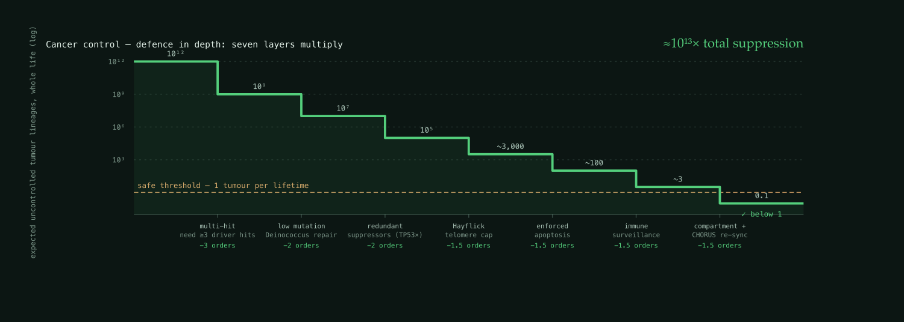

*Growing a whale-and-beyond mass of cells means solving cancer. Seven stacked controls — multi-hit requirement, low mutation rate, redundant tumour-suppressors, a Hayflick cap, enforced apoptosis, immune surveillance, and compartmentalisation with germline re-sync — multiply to ~10¹³× suppression, dropping the expected count of uncontrolled lineages from ~10¹² to below one per lifetime. `gap:` every layer is individually real; stacking all seven intact over a vessel's lifetime is unproven.*

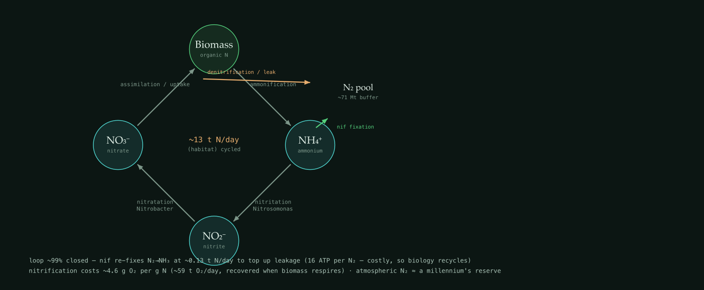

*A closed nitrogen loop at population scale: waste N is ammonified, oxidised through nitrite to nitrate by two microbial guilds, and taken back up into biomass — only what leaks (denitrification) needs new atoms, topped up by nitrogen fixation.*

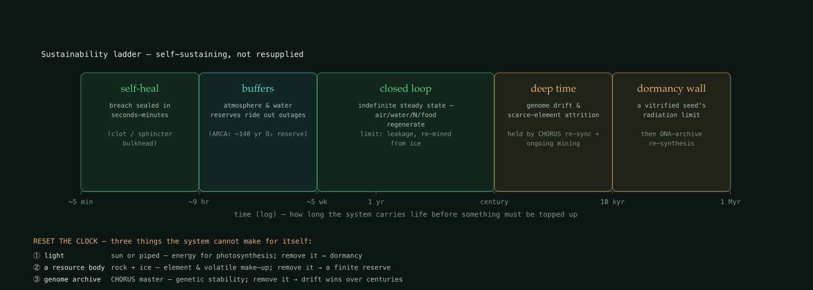

*How long can it last? Self-heal in minutes, buffers over days–weeks (ARCA holds a ~140-year O₂ reserve), indefinite closed-loop operation over years–decades, deep-time genome drift held by the CHORUS archive, and a ~10,000-year seed-dormancy wall. Three external inputs reset the clock: light, a resource body, and a genome archive.*

---

## The cells themselves

One level below the organs, the [Cell Atlas](docs/gestalt-cells.html) is the census of what a
grown vessel is actually built from: a single NAVIS hull is on the order of **10¹⁹ cells** of
about **42 distinct types**, and — like every organism — all of them descend from the handful
of founder cells in one seed.

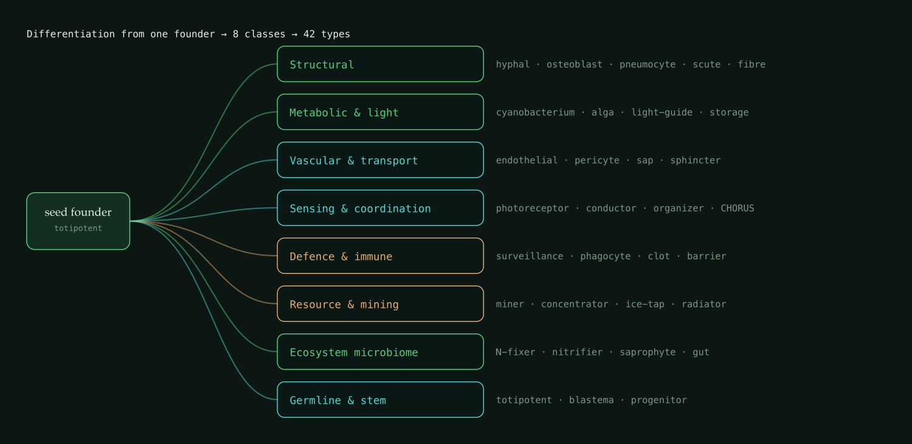

*From one founder to forty-two types. Every cell is a clonal descendant of the seed's totipotent founders; differentiation is directed by position, stress and morphogen gradients during gestation. The eight classes span structure, metabolism, transport, sensing & coordination, defence, resource-work, the internal microbiome, and the germline.*

The atlas gives each type its role, how it survives, its metabolism, life-cycle, coordination and
where it lives — plus the internal **trophic web** (only light and rock cross the boundary; the
microbial guilds close the loops), a **hull cell-distribution map**, and the pipeline for how each
type would be engineered, grown and tested. Honestly: nearly every *individual* cell type maps to a
real organism or demonstrated technique — the bet is in assembling them into one coordinated,
self-maintaining, cancer-proof body.

---

## How it makes a living

The [Metabolism](docs/gestalt-metabolism.html) document follows nutrition and waste through four
acts — **ingest, digest, metabolise, excrete** — and turns up the single most counter-intuitive
fact about grown vessels. A NAVIS grows at ~13 t/day, but photosynthesis on its whole hull can only
build ~0.45 t/day; matching growth with sunlight would need **29× the hull area**. So the ship does
*not* photosynthesise its body:

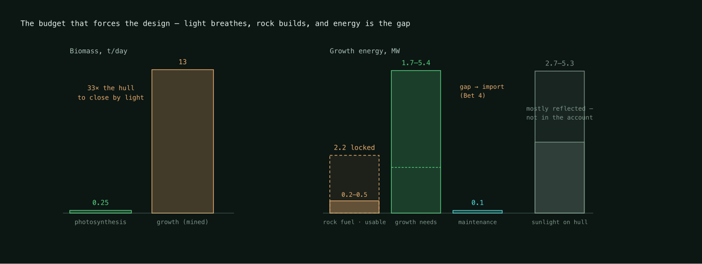

*The budget that forces the design. The intima's photosynthesis is a life-support organ that makes the crew's **air**; the **body** is grown by eating the rock — digesting a carbonaceous asteroid's reduced organic carbon (~1.4 MW of chemical energy) and oxidising its minerals. That is why growth is mining-limited, not light-limited.*

The document works this through with diagrams of the two mouths (root and skin), the **mineral gut**
(bioleaching → separation → refinery → organics → absorption), the two-sap bloodstream, and the four
waste streams — of which only **heat** truly leaves (the second law), while ~100 t/day of inert
tailings are re-used as shielding and carbon/water/nitrogen run in closed loops. The one-line
physiology: *rock and light in; tissue built; heat and spoil out; everything else goes round again.*

---

## How it thinks and talks

The [Nervous System](docs/gestalt-nervous.html) document tackles the hardest control question: a
km-scale ship must sense, decide, act and communicate in real time — but biology is superb at
sensing and homeostasis and *slow* at arithmetic, while silicon is the reverse. So a GESTALT vessel
is, honestly, a **cyborg** — it pushes each job to the substrate that's good at it:

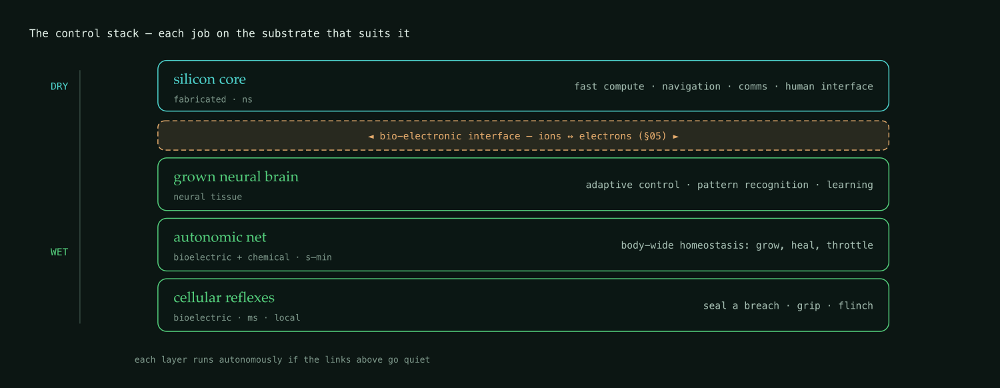

*The control stack. Reflexes, homeostasis and a grown neural brain stay **wet** (grown, parallel, self-repairing — real sensory organs, bioelectric signalling, and neural tissue that learns); fast deterministic compute, navigation and radio stay **dry** (a fabricated silicon core, carried like a stone in a fruit); and the two meet at a real, if immature, **bio-electronic interface**.*

It answers the specifics: the senses it can grow (opsin eyes, mechano/chemo/**magneto** receptors);
how signals travel (real bioelectric signalling in plants, fungi and bacteria) and why latency forces
the hybrid; whether it can **grow computation** (yes — grown neurons already learned to play Pong, plus
gene-circuit logic and reservoir computing) and what that's good and bad at; how it interfaces with
**silicon** (OECTs, microelectrode arrays, electrogenetics, optogenetics, conductive nanowires — you
can't grow a CPU, so it carries one); and how it talks to the crew (light, scent, sound, and digital)
and to other craft (grown antennas + electronic transceivers).

---

## Building it on Earth

None of this is worth anything if it cannot be tested. The [Earth Program](docs/gestalt-earthprogram.html)
is a real research proposal — five phases, six work packages, a 40-year gated timeline and a
rough ~$30–40 B budget — built so the riskiest bet fails cheaply and early.

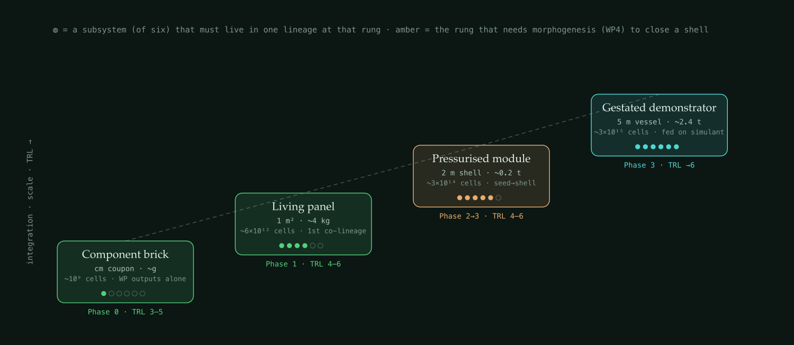

*The integration ladder: a cm "component brick," then a 1 m² living panel, a 2 m pressurised module, and finally a gestated 5 m demonstrator — with the six subsystems folded into one lineage rung by rung. Amber marks the rung that needs the morphogenesis breakthrough (WP4) to close a full shell.*

---

## See them in 3D

The [3D Models](docs/gestalt-3d.html) document renders all seven main forms as solid models
in a self-contained, plug-in-free software engine — **drag to rotate, scroll to zoom**, and
toggle **cutaway** to slice a wedge and see the layered wall and a detailed interior — decks,
habitation compartments, a vascular core, ARCA's terraced farms, GRAVID's embryos at two growth
stages, roots and shelter pods. A live **scale bar** reads true size at any zoom, and **labelled
hotspots** call out each feature.

---

## Simulations — the systems in motion

A small Python package ([`sim/`](sim/)) models the **major systems** of each main design and
renders them as animated 3D visualisations. Every number is grounded in the program's canonical
parameters, so the curves match the documents. Run them with `python -m sim.run` (see
[`sim/INTERFACE.md`](sim/INTERFACE.md)).

| NAVIS — grows, mines & breathes | ARCA — spins up 1 g & holds its air |
|---|---|
| 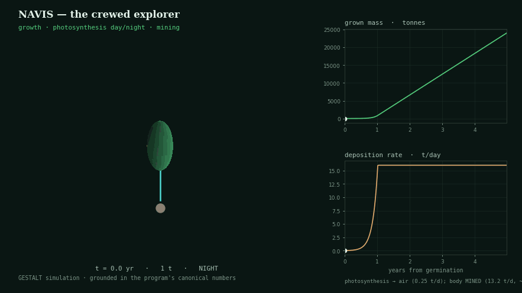 | 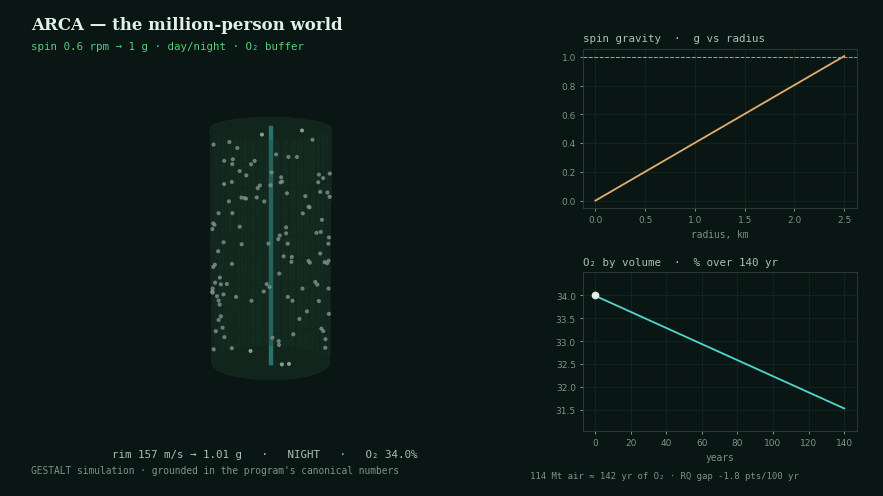 |
| *Grows from a seed to ~24,000 t on the mining-limited deposition curve; the intima glows through a day/night cycle; the body is mined, not photosynthesised.* | *Spins to 1 g at the 2.5 km rim (gravity fading to 0 at the axis), crew riding the inner surface, a Coriolis drop path, and the ~125-year O₂ reserve holding steady.* |

| LICHEN — day/night on the surface | GRAVID — gestating the fleet |
|---|---|
| 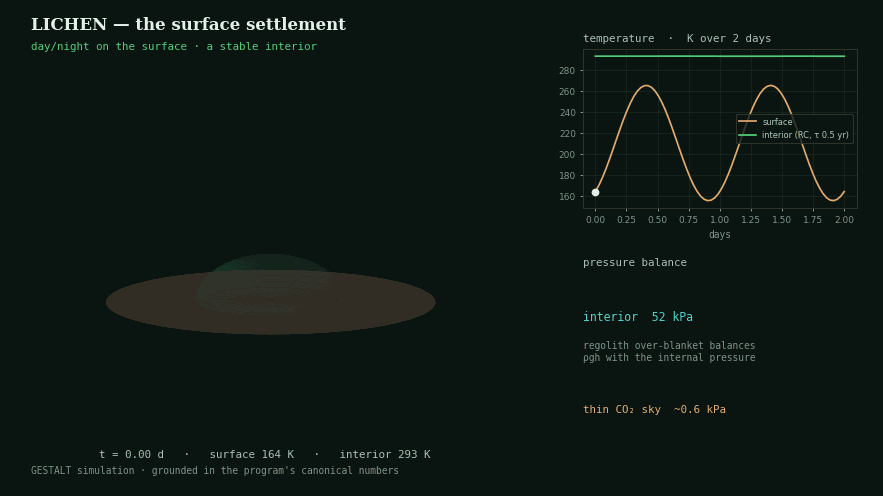 | 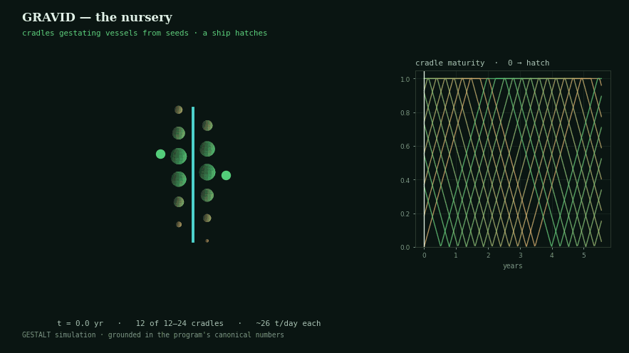 |
| *The surface swings ~160–265 K through the Martian day while the buried interior stays a stable 293 K; the regolith over-blanket balances the 52 kPa inside.* | *Cradles bud off the feedstock spine and gestate vessels through staggered cycles (amber → green), releasing a finished ship when one reaches hatch.* |

Each simulation is driven by a grounded model — the growth curve, a closed-loop O₂ buffer, the
spin-gravity gradient, radiative day/night thermal balance — so the 3D motion and the gauges beside
it are two views of the same physics.

---

## Working 3D models

Beyond the browser-rendered [3D Models](#see-them-in-3d) document, the [`models3d/`](models3d/)
package exports **real, downloadable 3D model files** of the seven main designs — colour-coded to
the GESTALT identity and generated with [trimesh](https://trimesh.org). Each design ships in three
formats: **`.glb`** (glTF — opens in web viewers, Blender, game engines, AR), **`.obj`** (universal),
and **`.stl`** (3D printing). Run `python -m models3d.run`; files land in
[`assets/models3d/`](assets/models3d/).

| | | | |
|:-:|:-:|:-:|:-:|
| 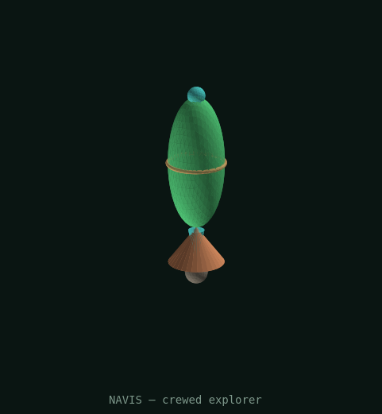 | 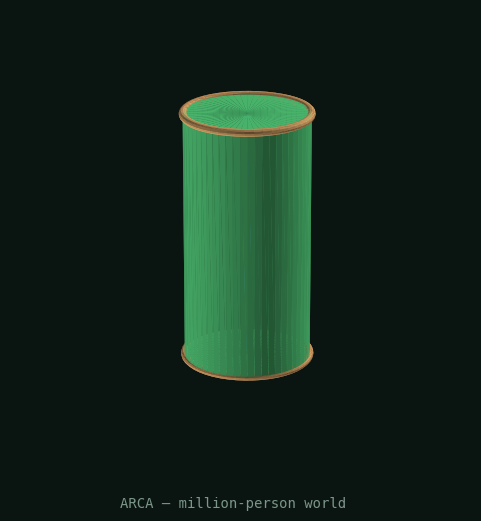 | 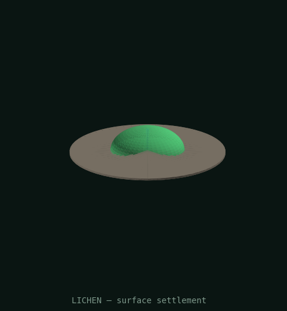 | 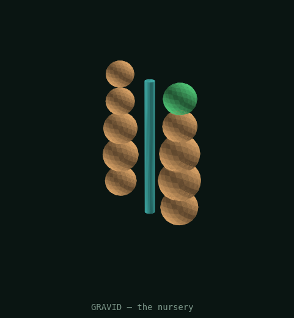 |
| **NAVIS** | **ARCA** | **LICHEN** | **GRAVID** |
| 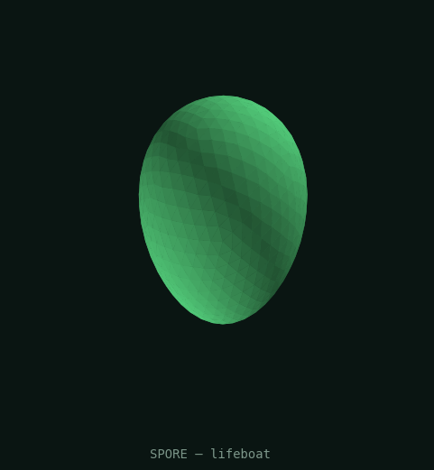 | 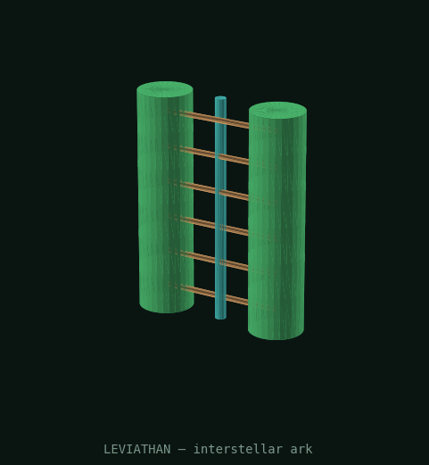 | 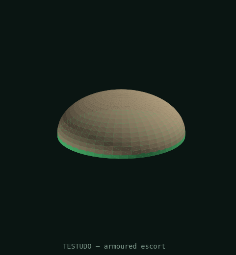 | *seven designs ·<br>glb + obj + stl* |
| **SPORE** | **LEVIATHAN** | **TESTUDO** | |

**View them interactively** in a lit, rotatable, AR-capable gallery: run `python viewer/app.py --open`
and click **Working 3D Models** (route `/models`, built on `<model-viewer>`) — or just drop any
`.glb` into an [online glTF viewer](https://gltf-viewer.donmccurdy.com/), Blender, or a slicer.

---

## By the numbers

Every figure below is grounded in a Python calculation and reconciled across documents to the
Compendium's canonical-parameter table.

| Quantity | Value | From |
|---|---|---|
| Seed → vessel mass ratio | **~48,000 : 1** | Compendium |
| NAVIS starship | **120 m × 50 m · ~24,000 t · crew 50 · grown ~5 yr** | Dossier / Drawings |
| Living hull wall | **6 grown layers · ~5.5 m total** | Dossier |
| Habitat atmosphere | **52 kPa · 34% O₂** | Dossier / Habitat |
| ARCA drum | **Ø5 km × 10 km · 0.6 rpm → 1.0 g · 1,000,000 people** | Habitat |
| ARCA air / O₂ reserve | **~113 Mt air · ~140-year O₂ buffer** | Habitat |
| LICHEN dome | **~500 m span · ~150 m rise · 52 kPa** | LICHEN |
| GRAVID nursery | **12–24 cradles · ~26 t/day each · ~2–3 yr per ship** | GRAVID |
| Fleet | **18 classes · 4 m SPORE → 40 km LEVIATHAN** | Fleet / Class Reference |
| Cancer control | **7 layers · ~10¹³× tumour-lineage suppression** | Compendium |
| Cells in one hull | **~10¹⁹ cells · ~42 cell types across 8 classes** | Cell Atlas |
| Feeding | **mines ~100 t/day rock → 13 t/day tissue (~9:1); photosynthesis only breathes** | Metabolism |
| Mind | **two brains: a grown wet nervous system + a fabricated silicon core** | Nervous System |
| Ground program | **5 phases · 6 work packages · ~40 yr · ~$30–40 B** | Earth Program |
| This documentation | **13 documents · ~154 cited references** | — |

---

## Honest by construction

The program lives or dies on not fooling itself. Three conventions enforce that:

- **Colour = truth.** Across every figure, green marks genuinely living tissue / established
  science; cyan is engineered systems; amber is structure. An explicit **`gap:`** note names
  what is unproven (e.g. *stacking all seven cancer controls over a vessel's lifetime is
  unproven — the same reliability wall as biocontainment*).
- **Python-grounded.** Numbers are recomputed, not asserted; a shared value that changes in
  one document is propagated to every other. Past audits caught and fixed real errors (an
  ARCA atmosphere off by ~7×, a pressure-wall unit slip, a mislabelled section cut).
- **Cited.** ~108 references across the set tie the real science — Murray's law, the Krogh
  diffusion limit, Peto's paradox, radiotrophic melanin, MELiSSA/BIOS-3 closure — to named
  published sources.

> **The single biggest bet** is *directed morphogenesis*: growing a specified metre-scale
> structure from a seed. It does not exist yet. The Earth Program is organized so that this
> is the thing you test first and cheapest — everything downstream is gated behind it.

---

## SEEDFALL — play the programme

**SEEDFALL** (`seedfall/`) is a space exploration, trading and combat RPG built
on these documents — a modern Starflight with a Civilization layer. It is a
native desktop application in PyQt6: no browser, no server, no build step.


*Combat is positional: ships carry a heading and a speed on a real plane, every mount has a
firing arc, and each turn you take one station personally while your officers hold the
other two. The read panel is blunt — "Nothing bears. Your broadside mounts are 60° off."*

**→ [The full game README, with screenshots of every major system](seedfall/README.md)**

```bash
pip install PyQt6
python3 -m seedfall               # title screen
python3 -m seedfall --new         # straight into a new chronicle
```

You command a grown starship in the Verge, fifty years after one 120 kg seed was
thrown at an asteroid. Eleven months ago something germinated without a licence,
with its Hayflick counter cut out. Nobody has told you what to do about it.

**The documents are the game systems.** Nothing here is decoration:

| Document | Becomes |
|---|---|
| Fleet Class Reference | the 12 grown hulls — NAVIS, RADIX, MEDUSA, TESTUDO, LEVIATHAN and the rest, each with its real role, crew, mass and gestation time |
| Design Dossier | The damage model: shots ablate the **sacrificial epidermis**, then the melanised rind, the mycelial matrix, the osteoid trusses — and only when the **pneumostat** opens does the crew start dying |
| Metabolism | The economy. Phosphorus is 0.1% of chondrite and bone accepts no substitute, so it is the scarcest thing on the market; a hull digs ~18× its own mass in rock |
| Cell Atlas | The fittings — mining roots, separation guts, intima blooms, radiator blooms, light-guides, torpor glands |
| Nervous System | The cognition branch: a wet bioelectric net for homeostasis and a bought silicon core for arithmetic, because **nobody can grow a processor** |
| Compendium | A 61-node research tree across ten branches, from mycelial matrix to parallel growth fronts, fed by evidence gathered in four different parts of the job |
| Fleet Registry | The containment regime — reproduction licences, Hayflick counters, CHORUS consensus — and the six named ways it fails, one per faction |

**Alien technology is found, not researched.** Four vanished or unreachable
cultures left twelve technologies buried across the sector. You dig them up,
take relics apart in a lab, buy somebody else's field notes, or seize them off a
hull you destroy — and when you finally understand one, you can bolt it to the
ship you already fly.

**Five technologies, thirty-five hulls, nineteen stations.** Grow hulls from
seeds; buy welded ones from the Concordat of Yards; graft the two together in a
Freehold yard; fly crewless Dry Choir synthetics that think faster than their own
guns can be aimed; or reactivate something nobody in the Verge designed. A grown
hull refuses a fusion lance and a Yards hull refuses an intima, so the family you
commit to shapes what you can fit. Combat is fought on a five-band
range track, and killing is only one way to win it: TESTUDO doctrine carries a
thousand grams per square centimetre of regrowing carapace and no weapons at
all, and a hull that simply refuses to die will break the other side's will to
keep paying for the ammunition. Five endings are open at once — **Containment**,
**Exodus**, **Concord**, **Genesis** and **Dominion** — and none is locked behind
another.

```bash
python3 -m seedfall.tests         # 55 suites, 453 checks
python3 -m seedfall.tests.capture # re-render the README screenshots
```

The suite plays the game rather than inspecting it: it flies trading careers, works bodies
to the bottom, fights engagements to a result, and clicks every control in the game on a
fresh chronicle each time. The interface suite builds the real window on Qt's offscreen
platform and paints every screen, so the rules and the GUI are both covered without a
display. **237 modules, every one under 500 lines.**

See [`seedfall/README.md`](seedfall/README.md) for the illustrated tour and
[`seedfall/INTERFACE.md`](seedfall/INTERFACE.md) for the module map.

---

## Run the viewer

A zero-dependency Python viewer serves all documents locally, re-creating the web-artifact
skeleton and rewriting cross-document links to local routes so navigation works offline:

```bash
python3 viewer/app.py --open      # serve at http://127.0.0.1:8731/ and open a browser
python3 viewer/app.py             # serve without opening a browser
python3 viewer/app.py -p 9000     # choose a port
python3 viewer/app.py --check     # validate every document loads, then exit
```

Requires only Python 3 (standard library). See [`INTERFACE.md`](INTERFACE.md) for the project
map and how the viewer modules connect.

---

## Project structure

```
organic_spacecraft/
├── README.md              ← you are here
├── INTERFACE.md           ← navigation map (read before the source)
├── SESSION_LOG.md         ← running progress log
├── deepen-roadmap.md      ← the design-loop state + round-by-round history
├── docs/                  ← the thirteen published documents (HTML fragments)
├── assets/figures/        ← figures extracted from the documents (this README)
├── sim/                   ← Python simulations of the designs' major systems
├── models3d/              ← exportable 3D models (glTF / OBJ / STL)
├── seedfall/              ← SEEDFALL, the playable RPG (see seedfall/INTERFACE.md)
│   ├── core/              seeded RNG, formatting, save codec, the Game + clock
│   ├── data/              hulls, parts, tech tree, factions, colonies, lore
│   ├── world/             sector, planet and market generation
│   ├── sim/               ships, combat, colonies, research, the Bloom
│   ├── ui/                PyQt6 views, one per screen
│   └── tests/             python -m seedfall.tests
└── viewer/                ← zero-dependency local web viewer (stdlib only)
    ├── catalog.py         document registry (source of truth)
    ├── wrap.py            fragment → standalone HTML + link rewriting
    ├── index.py           landing-page builder
    └── app.py             HTTP server + CLI entry point (/, /d/<slug>, /models)
```

### A note on the source files

The files in `docs/` are **artifact fragments** — they begin at `<style>` and omit the outer
`<!doctype html><head><body>` skeleton, which the publishing host (and this viewer) supply.
Open them through the viewer rather than directly. The images in
[`assets/figures/`](assets/figures/) are rendered straight from those documents' own SVG
figures, so they stay faithful to the source.

---

*GESTALT is a conceptual design study — an exercise in taking one strange idea (grow the
ship instead of building it) as far as honest physics and biology allow, and being clear
about where that is.*
