# SEEDFALL

**A native PyQt6 space exploration, trading and combat RPG — a modern *Starflight* with a
*Civilization* layer, played aboard a starship that was grown rather than built.**

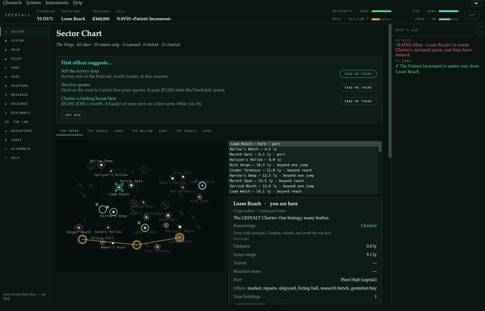

You command a GESTALT hull in the Verge: forty-two stars, six powers, and something in the
dark that eats rock, ice and colonies and is more of it every fortnight than it was. Survey
and trade, fight or refuse to, research a sixty-one-node tech tree, design hulls out of
grown organs and fabricated machinery, plant colonies, dig up alien technology nobody can
reason out, and deal with the Bloom.

SEEDFALL sits inside the [GESTALT design programme](../README.md) in this repository and
takes its physics from it — the hull classes, the six-layer hull, the phosphorus
bottleneck, the wet/dry cyborg control stack, and the reproduction-licence containment
regime are all the programme's.

```bash
pip install PyQt6
python -m seedfall                  # title screen
python -m seedfall --new            # straight into a new chronicle
python -m seedfall --seed verge-7   # a specific sector
python -m seedfall.tests            # 46 suites, 374 checks
```

No network, no server, no browser. Saves live in `~/.seedfall/save.json`.

---

## Contents

[Getting anywhere](#getting-anywhere-is-a-decision) ·
[A system](#a-system-and-what-is-in-it) ·
[Trade](#trade-and-the-freight-desk) ·
[Work](#work-worth-taking) ·
[Diplomacy](#diplomacy-has-two-axes) ·
[Research](#research-and-the-bench) ·
[Empire](#an-empire-you-have-to-defend) ·
[Hulls](#thirty-five-hulls-and-eighty-four-fittings) ·
[Combat](#combat-is-positional-and-you-only-have-one-seat) ·
[The ground](#there-is-a-game-on-the-ground) ·
[Xenology](#alien-technology-you-cannot-reason-out) ·
[Mini-games](#two-mini-games) ·
[The codex](#what-the-ground-told-you) ·
[Design rules](#how-it-is-built)

---

## Getting anywhere is a decision

A jump drops you at the system edge, not alongside anything. Bodies sit on real orbits
that keep moving while you fly, so the helm aims at where a target *will* be. Four burn
profiles trade reaction mass against days — and **coasting is always free**, which is what
stops an empty tank becoming a deadlock.

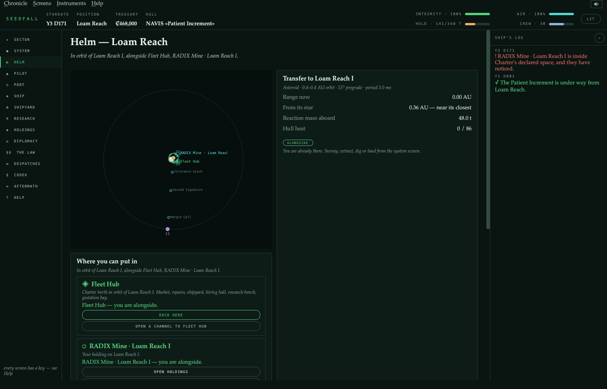

A hard burn arrives hot. Heat sheds on the clock, but over the cap the radiators stop
keeping up and the hull cooks — so burning hard repeatedly costs you real integrity, and
the panel tells you what you will arrive at before you commit.

| | days | reaction mass | hull, over a four-leg tour |
|---|--:|--:|--:|
| Coast | 89 | 0 t | — |
| Economy transfer | 59 | 6 t | — |
| Standard transfer | 48 | 11 t | — |
| Hard burn | **41** | 24 t | **−11%** |

## A system, and what is in it

Survey bodies to find biomes, lifeforms, anomalies and buried alien sites. Put a rig on
anything worth working — four methods, from skimming the surface to sinking a deep bore
that takes 0.81 of the body and is hard on the hull. The rig stops when the hold is full,
and the panel forecasts what a spell will actually raise.

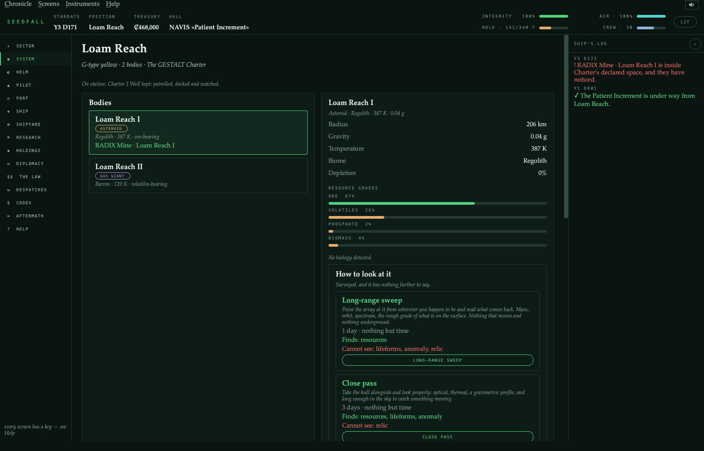

## Trade, and the freight desk

Fourteen goods, per-port supply and demand drifting daily toward each port's own
equilibrium — so the profitable run between two systems stays profitable for a while and
then quietly stops being.

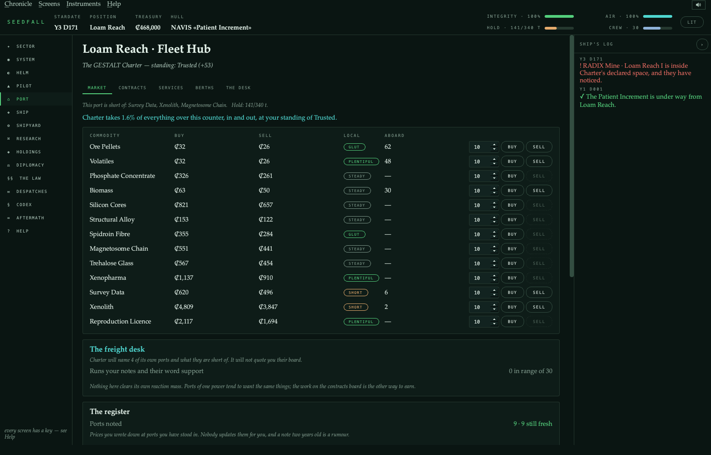

Within a starting jump only about one lane in twenty is worth flying, and finding it used
to mean visiting every neighbour first. The **freight desk** draws on two honest sources:
your own register of prices you wrote down, and the harbourmaster, who will name his own
power's ports and what they are short of but will not quote you their board. It ranks runs
by what the *voyage* clears, not the spread — a four-credit margin nine light-years away
costs more in reaction mass than it pays.

There is also an **unposted market**. One good in the table is contraband, worth more
exactly where it is forbidden, and the power that forbids it opens your hold at the dock.
A concealed hold, good standing and a clean approach each take a share off the odds; none
of them retires the risk.

## Work worth taking

Six kinds of contract, posted per port and scaled by distance, checked on the clock so one
completes the moment its terms are met. The board shows what the cargo will cost you and
what you will clear — a fee on its own once hid a board that was half traps.

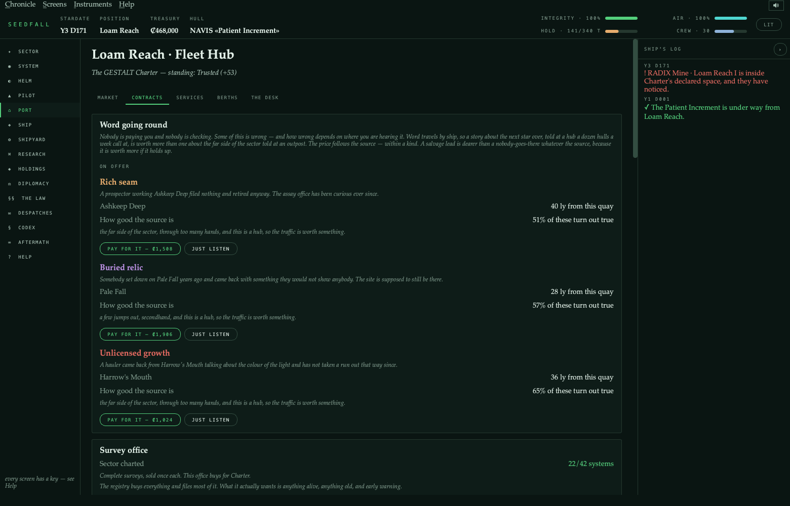

Taking a power's work is a position, not an errand: completing it costs you standing with
everyone that power is at odds with, in proportion to how bad the rift actually is.

## Diplomacy has two axes

Your standing with each power, and how the powers regard **each other** — a relations
matrix that starts hostile in most pairs. Tribute, intelligence and relief move the first;
only brokering moves the second, and brokering requires both parties to think well of you
already.

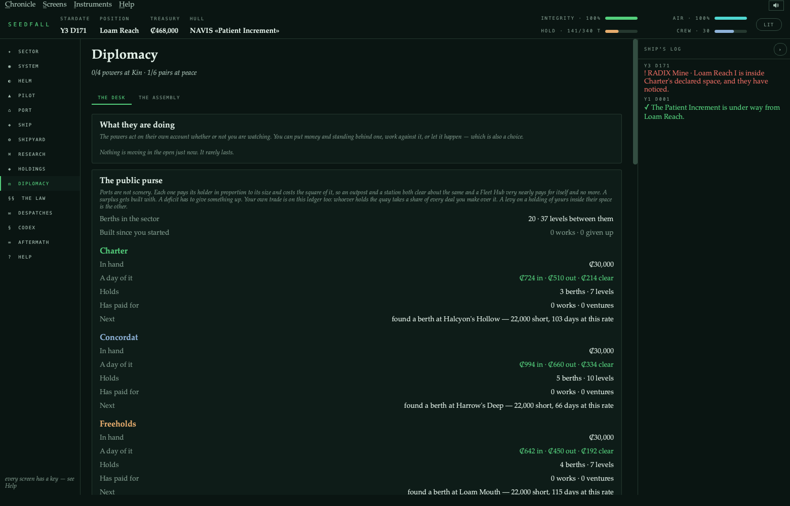

Every overture states what it will move before you commit — the target, third parties, and
the matrix. A treaty costs 30,000 credits *and* standing with the signatory's enemies, and
now says so.

**Concord** needs all four powers at Kin **and** all six pairs at peace, so it is a
diplomatic achievement rather than four grinds. And because brokering peace removes the
cost of working for a power, it pays for itself in ordinary play: the same 28 jobs return
108 total standing in a hostile sector and 170 in a brokered one.

## Research, and the bench

A sixty-one-node tree across ten branches and five tiers. A programme is fed by **evidence**
in four kinds, and the four come from four different parts of the job — a propulsion
programme cannot be fed by botany.

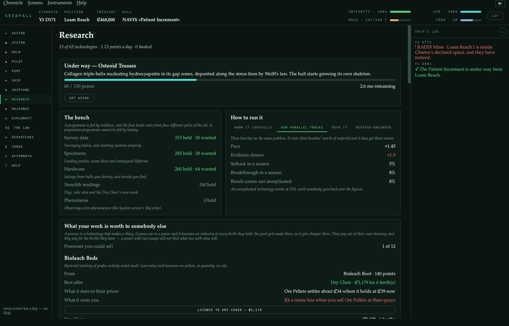

Four ways to run a programme: carefully, on parallel tracks, pushed, or reverse-engineered
from somebody else's work. Pushing is fastest and risks setbacks; parallel tracks cost
three benches' worth of material, and the shelves are read against what *this* approach
will actually take.

## An empire you have to defend

Nineteen colony and station classes and eight works that develop them. Plant one and walk
away; it yields every day, wherever you happen to be. The seed dialog says what will
grow — yield, upkeep, effects and a rough payback — because cost and gestation alone made
a Free Port at 74,000 credits read much like a mine at 12,000.

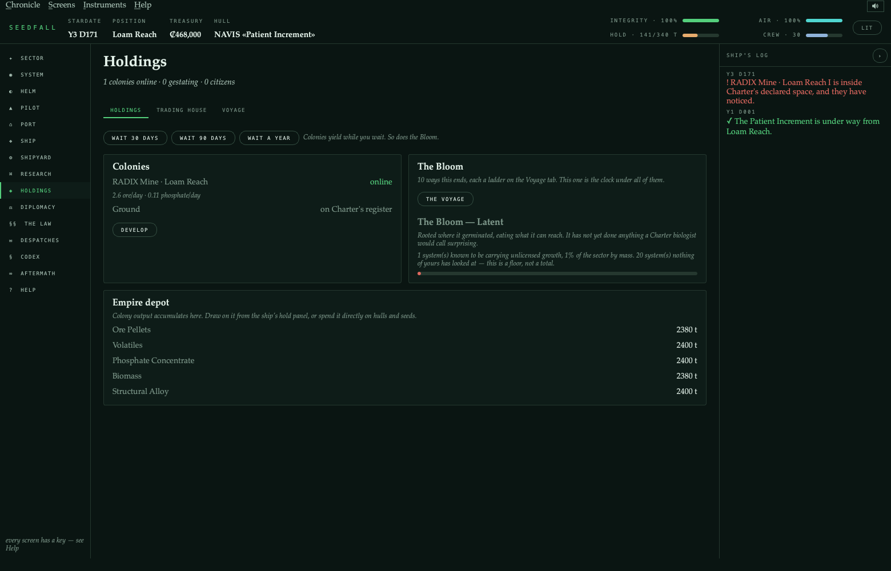

Territory is contested in both directions. Planting inside a power's declared space costs
standing, and at Distrusted they will not have you. And a power will annex a system you
hold in, which is a question rather than a news item: pay the levy and keep it, hand it
over, or refuse — and live with somebody eventually coming for it.

## Thirty-five hulls and eighty-four fittings

Five families, and which parts graft to which frame is a rule, not a suggestion: a grown
hull refuses a fusion lance, a Yards hull refuses an intima, a hybrid takes either.

| Family | Hulls | Character |
|---|--:|---|
| Grown | 12 | Gestated from a seed. Heals; eats phosphate; takes months. |
| Fabricated | 13 | Concordat of Yards. Welded in weeks, dear, and never mends. |
| Hybrid | 4 | Freehold grafts. Both bills, both gifts. |
| Synthetic | 4 | Dry Choir. Crewless, superb instruments, no self-repair. |
| Xeno | 2 | Not ours. It mends, and nobody has explained how. |

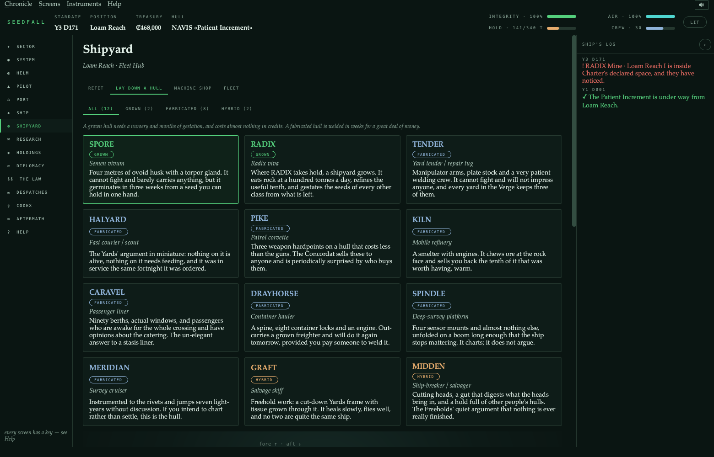

Fitted mass is not free — a full hold slows you down, and power discipline is real: draw
more than you generate and everything sags.

## Combat is positional, and you only have one seat

Ships carry a heading and a speed on a real plane. The five range bands still exist, but
the band is *derived* from an actual separation rather than stored, so closing is a
manoeuvre rather than a menu pick. Every mount has a firing arc and will refuse to fire
outside it.

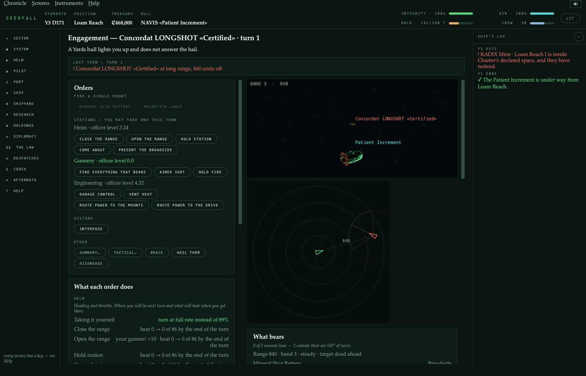

Each turn you take **one station** personally — Helm, Gunnery or Engineering — and your
officers hold the other two at their own level, which is competent and worse than you. The
bridge says what taking each seat is worth given who you have: gunnery is +22% to hit with
a green officer and +10% with a veteran, and an unattended helm repeats its last order at
seven-tenths of the turn rate.

The read panel is blunt about it — *"Nothing bears. Your broadside mounts are 60° off —
take the helm and turn before firing again."*

## There is a game on the ground

Landing a party opens a 7×7 zone revealed one tile at a time. Moving costs days of supply;
known ground is cheap to re-cross, which is what makes coming home survivable. Ten kinds of
feature, eight hazards, and weather overhead that can pin a party where it stands.

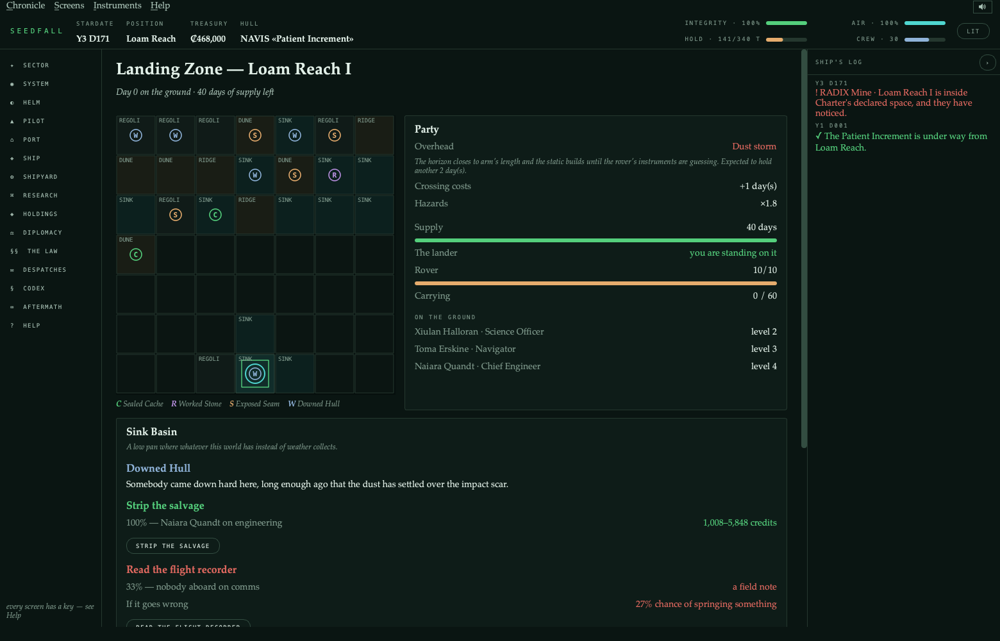

Every feature is a choice between two or three options, and each states its odds, the
officer who would take it, the prize, and what a failure risks. Reading a wreck's flight
recorder with nobody on comms is 33% with a 27% chance of springing something; stripping
the salvage next to it is 83%.

Nothing is banked until the party is back on the lander.

## Alien technology you cannot reason out

Four cultures left twelve technologies scattered across the sector as buried sites. None
can be derived. Understanding accumulates in study points from four sources: excavating a
site, taking relics apart in a laboratory, buying somebody's field notes at a port, and
seizing them off a hull you destroy.

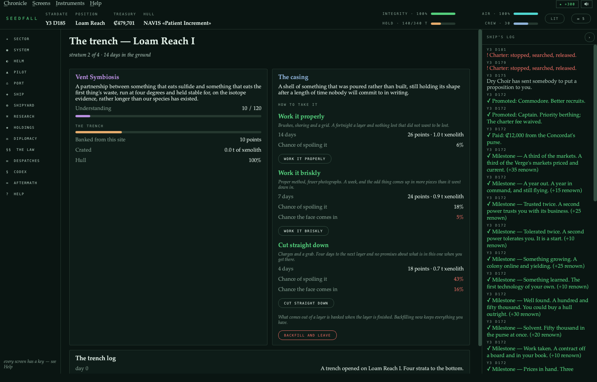

A dig has four strata, each holding more of the site's understanding than the one above and
each more fragile. Three ways to take a layer trade time against what survives — and
understanding banks **per layer**, so a trench abandoned after the casing is worth the
casing. That is what makes backfilling a choice rather than a way of throwing the dig away.

At full understanding a technology is *incorporated*: it never appears in the research
tree, because you could not have derived it.

## Two mini-games

The **docking approach** is the control loop from the programme's nervous-system study —
sense, compute, act, hold homeostasis — with three drifting axes, one correction per pass,
and readings blurred by how good your sensors are. A clean approach earns standing and buys
down a customs search; a botched one buys a tug.

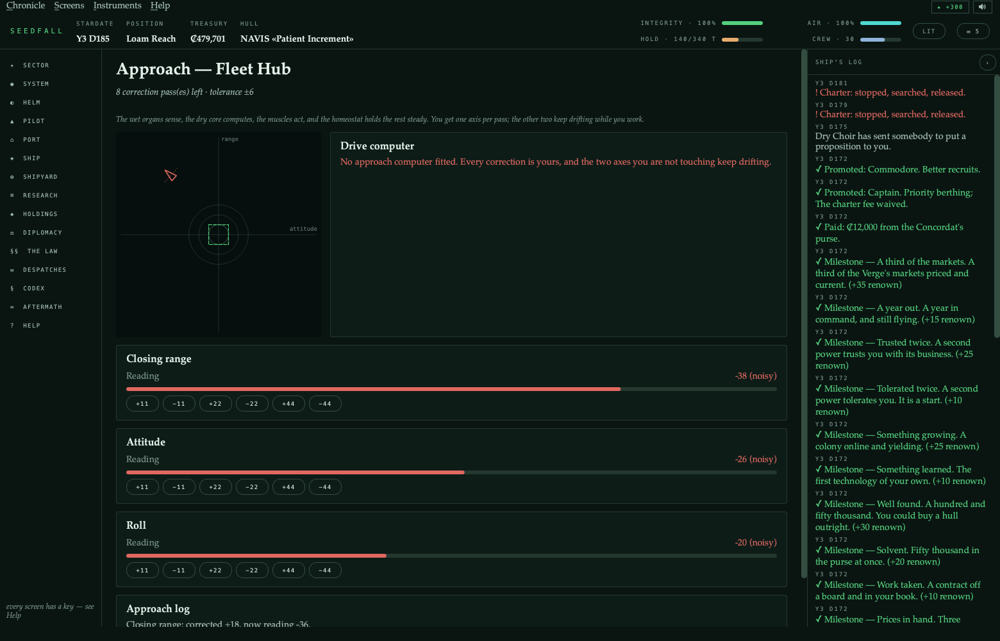

The **decoding bench** takes a recording of something that was not speaking to you: four
positions, a hidden pattern, and feedback that says how many glyphs are exactly right and
how many merely present, never which.

## What the ground told you

Field notes come off wrecks and old gardens, and only if somebody goes down and reads the
room. They are filed with the body and the day they were found, they are evidence on the
bench, and you can read them again.

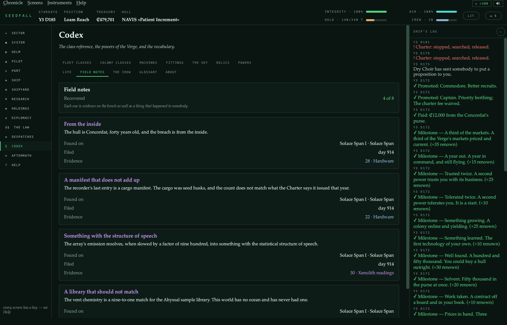

## How it is built

```
seedfall/
├── core/     engine primitives — no game rules, no Qt
├── data/     static content tables — pure data, no logic
├── world/    generated content: sector, planets, economy
├── sim/      game rules — never imports Qt
├── ui/       PyQt6 presentation — never decides anything
└── tests/    python -m seedfall.tests
```

Four rules the suite enforces rather than states:

- **`data → world → sim → ui`, one direction.** No module under `sim/`, `data/`, `world/`
  or `core/` imports Qt, and no module under `ui/` writes the ledger. Both breaches the
  project actually suffered were rules written *upward*, not imports pointing the wrong
  way.
- **Anything you can be in the middle of lives on the `Game`.** The window's navigation
  guard is parsed, and every activity it will divert you into must be a saved field —
  which is how a crossing, an approach, a decoding exchange, an open trench and a power
  waiting on an answer all survive a save.
- **A screen that offers a commitment must state its consequence**, and what it states must
  be what happens. Eight preview functions — contracts, freight, mining, the bench,
  overtures, seats, colonies, ground options — each pinned by a check that performs the
  thing and compares.
- **Nothing computed that nothing consumes.** Every public function must be called by
  something, every content gate must name a technology that exists, and every feature that
  claims to change a number is switched off by an efficacy harness that fails if the
  measurement does not move.

**196 modules, every one under 500 lines. 46 suites, 374 checks.**

---

*SEEDFALL is a game about a concept study. Where the underlying science is real the
programme documents mark and cite it; where it is a bet, the bet is named. The game takes
the bets as settled — that is what makes it a game.*
