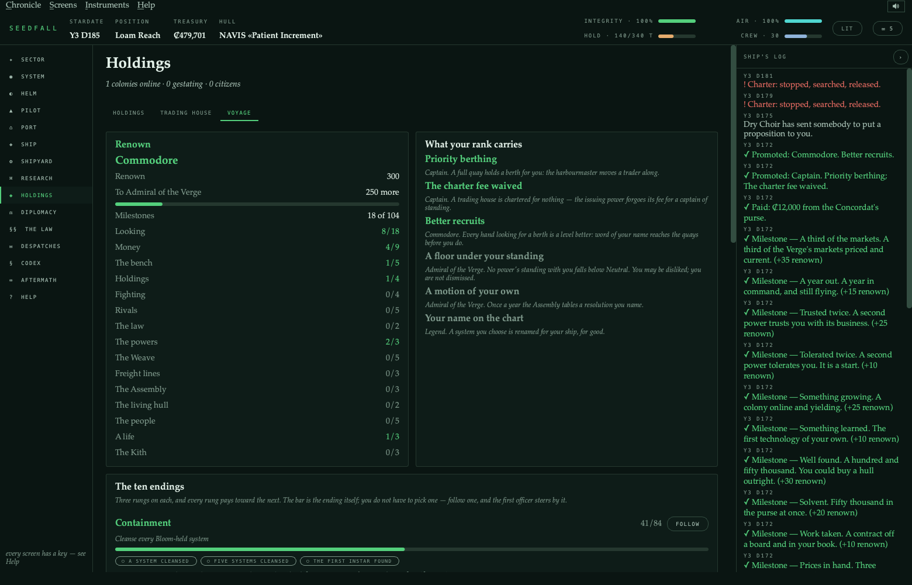
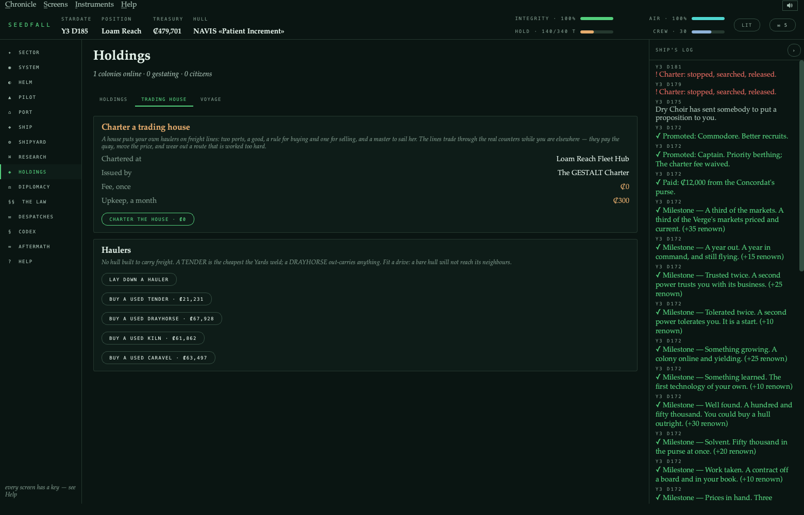
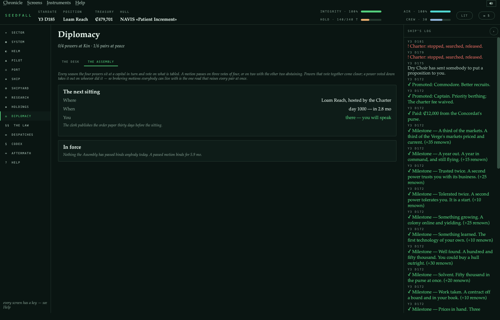
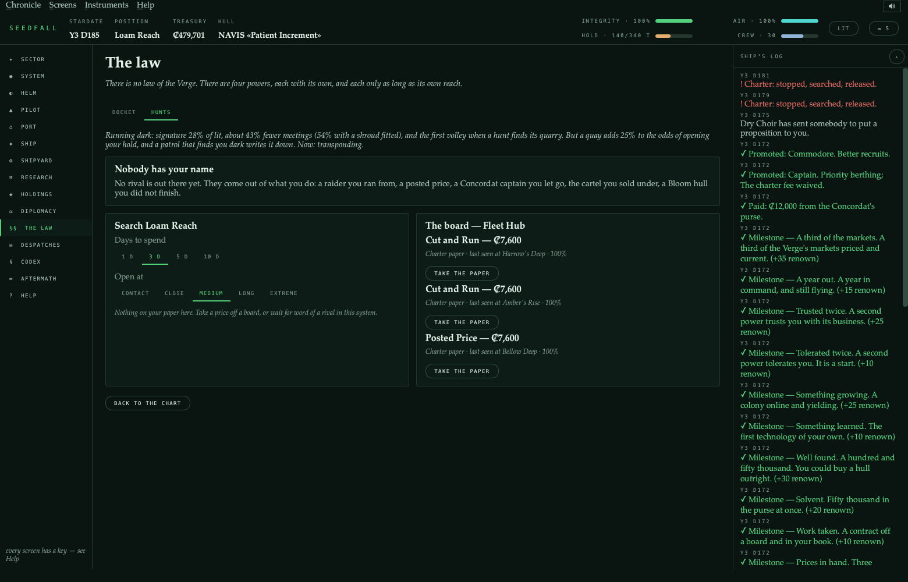
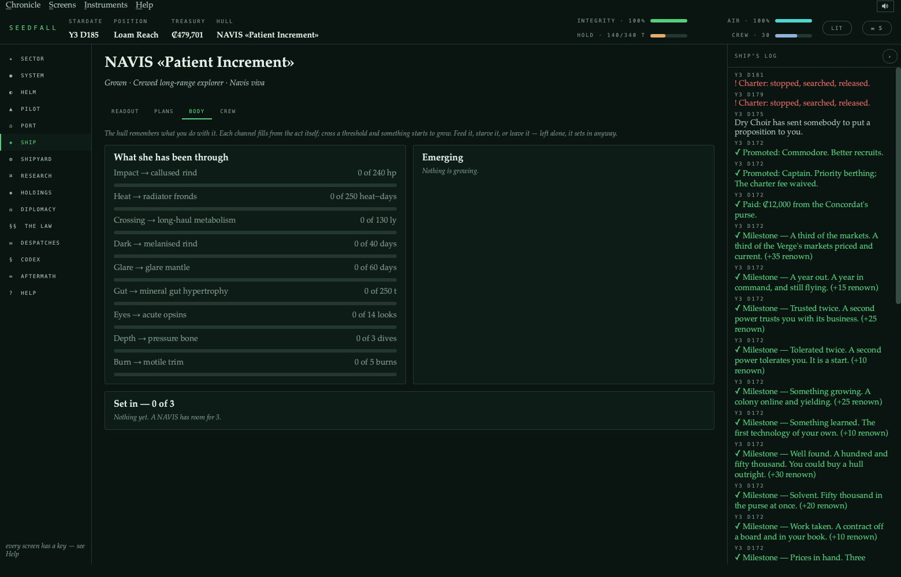
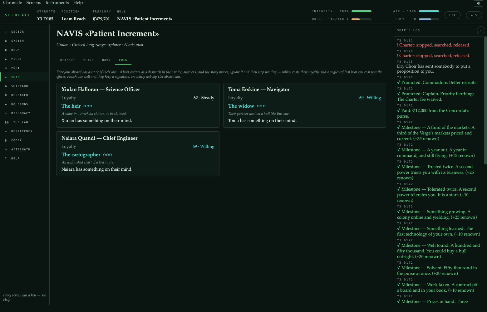
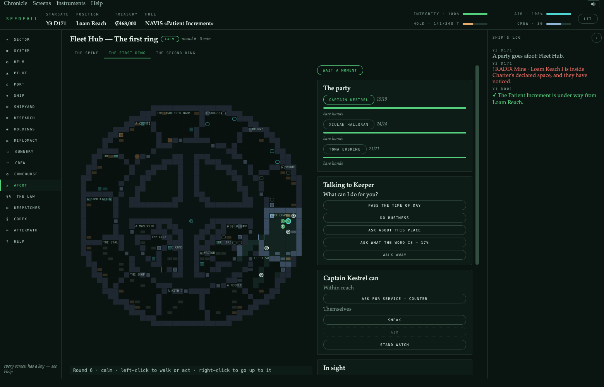
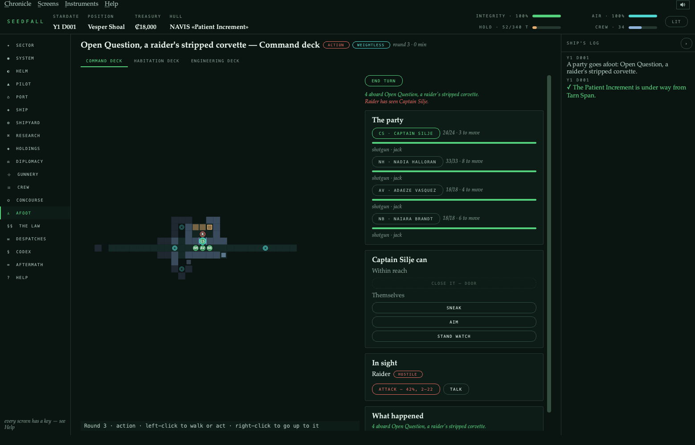
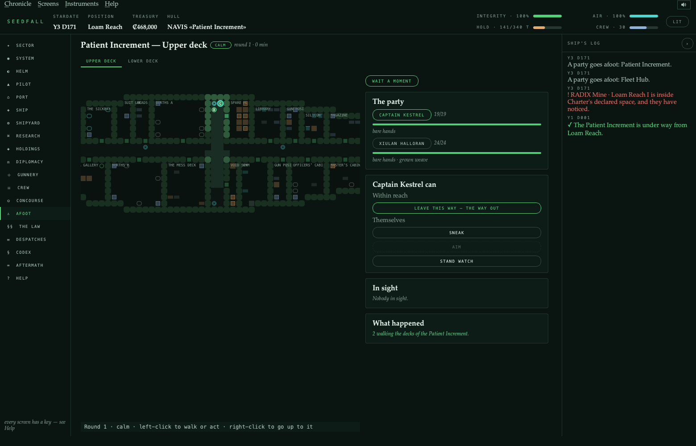
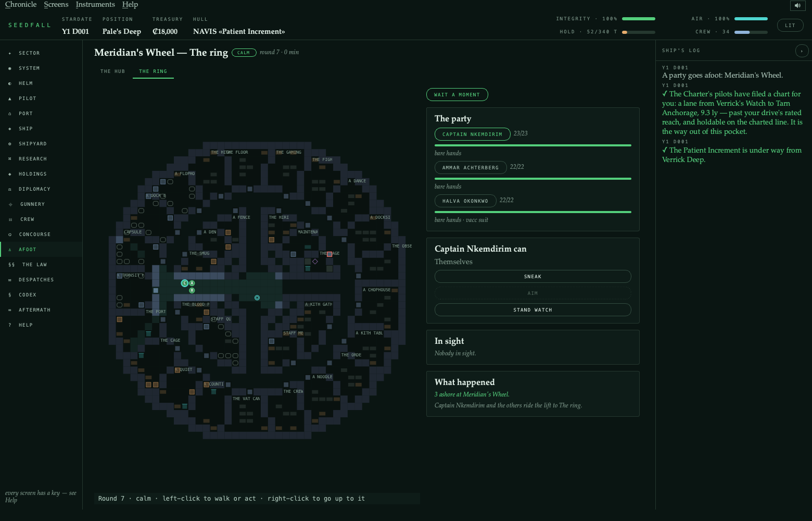

# SEEDFALL

**A native PyQt6 space exploration, trading and combat RPG — a modern *Starflight* with a
*Civilization* layer, played aboard a starship that was grown rather than built.**


You command a GESTALT hull in the Verge: forty-two stars, four powers, three regions beyond the
rim, and something in the
dark that eats rock, ice and colonies and is more of it every fortnight than it was. Survey
and trade, fight or refuse to, research a sixty-three-node tech tree, design hulls out of
grown organs and fabricated machinery, plant colonies, dig up alien technology nobody can
reason out, and deal with the Bloom.

SEEDFALL sits inside the [GESTALT design programme](../README.md) in this repository and
takes its physics from it — the hull classes, the six-layer hull, the phosphorus
bottleneck, the wet/dry cyborg control stack, and the reproduction-licence containment
regime are all the programme's.

```bash
pip install PyQt6
python3 play.py                     # title screen (from the project folder)
python -m seedfall                  # the same, from anywhere the package is
python -m seedfall --new            # straight into a new chronicle
python -m seedfall --seed verge-7   # a specific sector
python -m seedfall --help           # every option, and where the save lives
python -m seedfall.tests -j 8       # ~250 suites, ~1,900 checks, ~4 minutes
```

No network, no server, no browser. Saves live in `~/.seedfall/save.json`.

---

## Contents

[Getting anywhere](#getting-anywhere-is-a-decision) ·
[A system](#a-system-and-what-is-in-it) ·
[Trade](#trade-and-the-freight-desk) ·
[Work](#work-worth-taking) ·
[Diplomacy](#diplomacy-has-two-axes) ·
[Research](#research-and-the-bench) ·
[Empire](#an-empire-you-have-to-defend) ·
[Hulls](#thirty-seven-hulls-and-eighty-nine-fittings) ·
[Combat](#combat-is-positional-and-you-only-have-one-seat) ·
[The ground](#there-is-a-game-on-the-ground) ·
[Xenology](#alien-technology-you-cannot-reason-out) ·
[Mini-games](#two-mini-games) ·
[The codex](#what-the-ground-told-you) ·
[Beyond the Verge](#beyond-the-verge--what-2026-09-added) ·
[Afoot](#afoot--the-verge-at-walking-pace) ·
[Design rules](#how-it-is-built)

---

## Getting anywhere is a decision

A jump drops you at the system edge, not alongside anything. Bodies sit on real orbits
that keep moving while you fly, so the helm aims at where a target *will* be. Four burn
profiles trade reaction mass against days — and **coasting is always free**, which is what
stops an empty tank becoming a deadlock.


A hard burn arrives hot. Heat sheds on the clock, but over the cap the radiators stop
keeping up and the hull cooks — so burning hard repeatedly costs you real integrity, and
the panel tells you what you will arrive at before you commit.

| | days | reaction mass | hull, over a four-leg tour |
|---|--:|--:|--:|
| Coast | 89 | 0 t | — |
| Economy transfer | 59 | 6 t | — |
| Standard transfer | 48 | 11 t | — |
| Hard burn | **41** | 24 t | **−11%** |

## A system, and what is in it

Survey bodies to find biomes, lifeforms, anomalies and buried alien sites. Put a rig on
anything worth working — four methods, from skimming the surface to sinking a deep bore
that takes 0.81 of the body and is hard on the hull. The rig stops when the hold is full,
and the panel forecasts what a spell will actually raise.


## Trade, and the freight desk

Sixteen goods (two of them only from beyond the rim), per-port supply and demand drifting daily toward each port's own
equilibrium — so the profitable run between two systems stays profitable for a while and
then quietly stops being.


Within a starting jump only about one lane in twenty is worth flying, and finding it used
to mean visiting every neighbour first. The **freight desk** draws on two honest sources:
your own register of prices you wrote down, and the harbourmaster, who will name his own
power's ports and what they are short of but will not quote you their board. It ranks runs
by what the *voyage* clears, not the spread — a four-credit margin nine light-years away
costs more in reaction mass than it pays.

There is also an **unposted market**. One good in the table is contraband, worth more
exactly where it is forbidden, and the power that forbids it opens your hold at the dock.
A concealed hold, good standing and a clean approach each take a share off the odds; none
of them retires the risk.

## Work worth taking

Six kinds of contract, posted per port and scaled by distance, checked on the clock so one
completes the moment its terms are met. The board shows what the cargo will cost you and
what you will clear — a fee on its own once hid a board that was half traps.


Taking a power's work is a position, not an errand: completing it costs you standing with
everyone that power is at odds with, in proportion to how bad the rift actually is.

## Diplomacy has two axes

Your standing with each power, and how the powers regard **each other** — a relations
matrix that starts hostile in most pairs. Tribute, intelligence and relief move the first;
only brokering moves the second, and brokering requires both parties to think well of you
already.


Every overture states what it will move before you commit — the target, third parties, and
the matrix. A treaty costs 30,000 credits *and* standing with the signatory's enemies, and
now says so.

**Concord** needs all four powers at Kin **and** all six pairs at peace, so it is a
diplomatic achievement rather than four grinds. And because brokering peace removes the
cost of working for a power, it pays for itself in ordinary play: the same 28 jobs return
108 total standing in a hostile sector and 170 in a brokered one.

## Research, and the bench

A sixty-three-node tree across ten branches and five tiers. A programme is fed by **evidence**
in four kinds, and the four come from four different parts of the job — a propulsion
programme cannot be fed by botany.


Four ways to run a programme: carefully, on parallel tracks, pushed, or reverse-engineered
from somebody else's work. Pushing is fastest and risks setbacks; parallel tracks cost
three benches' worth of material, and the shelves are read against what *this* approach
will actually take.

## An empire you have to defend

Nineteen colony and station classes and eight works that develop them. Plant one and walk
away; it yields every day, wherever you happen to be. The seed dialog says what will
grow — yield, upkeep, effects and a rough payback — because cost and gestation alone made
a Free Port at 74,000 credits read much like a mine at 12,000.


Territory is contested in both directions. Planting inside a power's declared space costs
standing, and at Distrusted they will not have you. And a power will annex a system you
hold in, which is a question rather than a news item: pay the levy and keep it, hand it
over, or refuse — and live with somebody eventually coming for it.

## Thirty-seven hulls and eighty-nine fittings

Five families, and which parts graft to which frame is a rule, not a suggestion: a grown
hull refuses a fusion lance, a Yards hull refuses an intima, a hybrid takes either.

| Family | Hulls | Character |
|---|--:|---|
| Grown | 12 | Gestated from a seed. Heals; eats phosphate; takes months. |
| Fabricated | 13 | Concordat of Yards. Welded in weeks, dear, and never mends. |
| Hybrid | 4 | Freehold grafts. Both bills, both gifts. |
| Synthetic | 4 | Dry Choir. Crewless, superb instruments, no self-repair. |
| Xeno | 4 | Not ours: two relic hulls nobody can explain, and two the Kith grow at an accord. |


Fitted mass is not free — a full hold slows you down, and power discipline is real: draw
more than you generate and everything sags.

## Combat is positional, and you only have one seat

Ships carry a heading and a speed on a real plane. The five range bands still exist, but
the band is *derived* from an actual separation rather than stored, so closing is a
manoeuvre rather than a menu pick. Every mount has a firing arc and will refuse to fire
outside it.


Each turn you take **one station** personally — Helm, Gunnery or Engineering — and your
officers hold the other two at their own level, which is competent and worse than you. The
bridge says what taking each seat is worth given who you have: gunnery is +22% to hit with
a green officer and +10% with a veteran, and an unattended helm repeats its last order at
seven-tenths of the turn rate.

The read panel is blunt about it — *"Nothing bears. Your broadside mounts are 60° off —
take the helm and turn before firing again."*

## There is a game on the ground

Landing a party opens a 7×7 zone revealed one tile at a time. Moving costs days of supply;
known ground is cheap to re-cross, which is what makes coming home survivable. Ten kinds of
feature, eight hazards, and weather overhead that can pin a party where it stands.


Every feature is a choice between two or three options, and each states its odds, the
officer who would take it, the prize, and what a failure risks. Reading a wreck's flight
recorder with nobody on comms is 33% with a 27% chance of springing something; stripping
the salvage next to it is 83%.

Nothing is banked until the party is back on the lander.

## Alien technology you cannot reason out

Four cultures left twelve technologies scattered across the sector as buried sites. None
can be derived. Understanding accumulates in study points from four sources: excavating a
site, taking relics apart in a laboratory, buying somebody's field notes at a port, and
seizing them off a hull you destroy.


A dig has four strata, each holding more of the site's understanding than the one above and
each more fragile. Three ways to take a layer trade time against what survives — and
understanding banks **per layer**, so a trench abandoned after the casing is worth the
casing. That is what makes backfilling a choice rather than a way of throwing the dig away.

At full understanding a technology is *incorporated*: it never appears in the research
tree, because you could not have derived it.

## Two mini-games

The **docking approach** is the control loop from the programme's nervous-system study —
sense, compute, act, hold homeostasis — with three drifting axes, one correction per pass,
and readings blurred by how good your sensors are. A clean approach earns standing and buys
down a customs search; a botched one buys a tug.


The **decoding bench** takes a recording of something that was not speaking to you: four
positions, a hidden pattern, and feedback that says how many glyphs are exactly right and
how many merely present, never which.

## What the ground told you

Field notes come off wrecks and old gardens, and only if somebody goes down and reads the
room. They are filed with the body and the day they were found, they are evidence on the
bench, and you can read them again.


## Beyond the Verge — what 2026-09 added

Ten systems, each with its own suite, and each stating its cost before you commit:

- **The Far Reaches** (Sector Chart tabs; the System screen at a rim anchor) — relight a deep
  anchor with a survey, the *Deep Weave* technology and a material bill, and three regions
  open: the **Shoals** (a nebula that halves your sensors, rich in *condensate*), the
  **Hollow** (long dark lanes, sunless rogue worlds, a dead culture's ruins), the **Cradle**
  (young hot stars, hard radiation, and the Kith).
- **The Kith** (a gathering's quay; the Codex) — a living people who speak in light. Learn
  their 24 signs by listening, on the decoding bench and in exchanges; trade by gift, never
  by price; a misread costs standing and sometimes a fight; an accord grows their hulls.
- **Stellar phenomena** (the System screen's Sky strip; the chart) — flares (shelter in a
  body's shadow), comets to mine, ion storms that close lanes, and one nova, all forecast
  honestly on the despatch board; *observe* them for evidence the Charter and Choir buy.
- **Rivals and the hunt** (The law → Hunts) — named captains who remember you, come back a
  level stronger, and can be spared into allies; a bounty board, searches with stated odds,
  trophies, and a switch to **run dark**.
- **The living hull** (Ship → Body) — a grown hull records what it goes through and grows
  adaptations (a callused rind, radiator fronds, a melanised skin); encourage, suppress or
  have one pruned at a Fleet Hub. Welded hulls never change.
- **Freight lines** (Holdings → Trading house) — charter a house, put haulers on routes,
  hire masters; every trip trades through the real markets, saturates them, and pays its
  way or does not, with a forecast that matches the ledger.
- **The Assembly** (Diplomacy → The Assembly) — every season the powers vote on two or three
  resolutions that change the rules for a term; lobby, pay, leak or speak in person.
- **Officer arcs** (Ship → Crew; the Despatches board) — each officer's own three-beat story,
  answered in costed choices, ending in a signature ability.
- **Renown and the Voyage** (Holdings → Voyage; the Sector Chart's counsel card) — ranks with
  real perks, three milestones on every ending, the first officer's three next moves, and a
  memoir kept in the Hall of Captains.
- **Sound** (Options → Sound) — about thirty cues synthesised at first run: the log's news,
  a held burn, the collision guard, a berth made fast, the guns, and the Bloom's slow swell.

| The Voyage | The trading house | The Assembly |
|---|---|---|
|  |  |  |
| **The hunt** | **The living hull** | **Officer arcs** |
|  |  |  |

## Afoot — the Verge at walking pace

Everything else in SEEDFALL happens at the scale of a hull. **Afoot** (`o` on the rail, or
*Walk the decks* on the Ship screen and *Walk it* on the Concourse) is the scale of a person:
a turn-based tactical layer in the manner of *Star Frontiers* and *Traveller*, played on
deck plans of the places the game already has.

| A Fleet Hub's ring, walked | A dead hull, boarded |
|---|---|
|  |  |
| **Your own hull, in its own shape** | **A gaming wheel, in orbit** |
|  |  |

- **Every plan is the shape of the thing it is a plan of** (`sim/afoot_plans.py`):
  - **a hull** is sliced through its own silhouette — the length, beam and taper law its 3D
    model is built from, an ellipse fatter aft for a grown hull, a box flaring to a slab bow
    for a Yards one, bent off its axis for a xeno one, a lattice of nodes and crawlways for a
    Dry Choir frame. Inside it is a **working ship**: a bridge forward and the drives aft,
    every fitting at its own slot's mount, berths for the whole complement, a galley, heads,
    a sickbay, air, water, tanks, stores, a workshop, lifeboats and suit lockers, holds as big
    as the cargo rating, and whatever the role adds (a liner's cabins and saloon, a hospital's
    wards, a warship's magazine and marines). Nothing it needs is left out: a hull that cannot
    hold its program is given another deck, and past that is drawn longer. Refit her and the
    plan changes;
  - **a quay** is its can, its arm out to the berths, and its mast; **a Fleet Hub** its spine,
    four arms with a berth on each, and two habitation rings on spokes, each as many levels
    deep as it needs — every level drawn **unrolled**, a strip whose two ends are the same
    corridor, turned under the party so it has no ends: walk on round and you come back to
    where you started. **Every door the Concourse lists is
    a room on the plan**, by the same
    name, and a quay counts its own people — a Fleet Hub has 36,000 aboard and serves the
    million on the world below;
  - **a holding or habitat** is what its class's traits say it is built as — the town inside
    an ARCA drum, the floors of a STACK arcology, the open ground under a LICHEN dome, a ring
    round a hub, a mine's works dug into its rock, or modules on a keel;
  - **a settlement or a base** is streets and sheds on the ground: open to a sky you can
    breathe, or tubes and a landing hangar sealed against one you cannot.
- **Where**: your own hull, the starport, habitat drums, your holdings, the powers'
  settlements, **the trade's own stations and bases** (below), a derelict adrift in the system
  (a holed survey hull, a lost liner, a raider's hulk that is not as dead as it looks, a
  silent Dry Choir probe, a freighter the Bloom took, a hospital ship under quarantine, a yard
  that went bankrupt mid-hull, a habitat ring that went quiet), and a struck prize — *Board
  her first* on the battle's prize dialog. The same station has the same layout every time
  you put in.
- **Getting there** (`sim/crossing.py`): a chronicle starts **made fast** alongside its home
  quay — on the flight deck the hull lies at the berth — and the crew walks across. Anywhere
  else the hull is only *in orbit near* things until it comes alongside (the harbour's pilot,
  or the conn), and until then the crew **crosses**: in the ship's boat (a hull with a crew of
  six or more carries one, in a boat bay you can walk to), on the place's own shuttle for a
  fare, or in suits on a line across a couple of kilometres of open space. Every door that
  takes money, and every walk, asks whether the crew is across; the Concourse and the start
  page offer the ways. Cargo and a yard's business still go by lighter from orbit.
- **Who**: up to four of the captain, the officers and the walking machines aboard. Each is
  the person the game already knows: the six characteristics and skills of their service
  record, the kit they own, and the wounds they came back with last time. The captain's
  record is a life played out term by term by the same `sim/lifepath` as every officer's,
  from their origin and their lineage.
- **What it weighs** (`Deck.g`, shown beside the deck's name): hulls and quays are
  weightless, a Habitat Girdle's berths 0.4 g, ring levels spun at 0.8 g (the outermost the
  heaviest), a drum's floor 1 g, the ground its world's own. Weightless, anybody without
  Zero-G goes hand over hand at twice the cost of a step, shoots unbraced, and is set
  drifting by the kick of a gun — magnetic boots put it right, and the people who live aboard
  are at home in it. A heavy world slows everybody.
- **How**: every roll is two dice against eight and every button says its odds first. Guns
  and armour are the kit the concourse sells, with Traveller's numbers. In calm the party
  walks and follows its leader; once somebody hostile has seen you it is turns — move, act,
  end turn. Doors, lockers, consoles, lifts, cover, sneaking, standing watch, first aid,
  carrying the fallen. A gun with Auto fires a **burst** or lays down **suppressing fire**
  that pins whoever is round the target; **frag, stun and smoke grenades** are thrown,
  off by a square on a miss, and smoke blinds every line through it for three rounds.
- **Who else**: the keeper behind each counter (do business there: the shelf, a room, a
  night, the hiring board, the harbourmaster's favours), constables as many as the law level
  puts on the corridors, fences and hard cases where it puts none, your own officers at
  their stations (a word with them, their report, their story), and on the dead hulls
  whoever their end left aboard. Somebody from an officer's past may be waiting on the
  concourse, by name. **Trouble** comes out of what the game keeps: two officers whose
  convictions collide at it on your own decks, a toll or a brawl where the law is thin, your
  own works failing, striking or sabotaged — and setting them right by hand runs the holding
  sweeter for a month. At a Kith gathering they sing a phrase for you to answer, and an elder
  may sing a domain's song of passage; a xeno vault's relic gives itself up in three stages.
- **Where it fits**: counsel suggests the dead hull adrift here and the officer nobody has
  had a word with; the Academy has a chapter on foot (walk, talk, shoot back); five renown
  rungs read a career afoot — walks, prizes boarded, wrecks cleared, kinds of place, nests
  burned.
- **What it costs**: what anybody sees you do is a charge when you leave — and a bribe buys
  only the witness you paid. What you find comes home only if you walk out with it — kit to
  the captain, cargo to the hold, data to the bench. Wounds are kept and mend by the day, or
  at a clinic; a stun wears off. The captain always comes home; an officer left lying where
  people live is found and brought back, and one left on a dead hull is not.

### Yards, hotels, wheels and dens

Besides its quay, a system has whatever the trade has built round it
(`data/establishments.py`): **shipyards** and **hull nurseries**, **grand hotels** and
**spacers' rests**, **pleasure palaces**, **surgical stations**, **spa stations**, **gaming
wheels** and **free markets** in orbit; **mining** and **research bases**, **garrisons**,
**farms**, **retreats** and **smugglers' dens** on the ground. A Fleet Hub's system has three
or four, a quiet rock one at most, all of them read off the seed and spending no luck.

A station is a berth on the System chart, drawn in the sky as the structure it is built like;
fly to it, hail it, go aboard. A base stands on its world and keeps **a pad in orbit** over it,
its landing field's berth: fly to it, and go down. Each opens **its own signature
doors, there and nowhere else** — the Grand's suites and ballroom, the wheel's high table and
the cage that pays out in the morning, the springs' thermal baths, a quiet surgeon who keeps
no records — and of everybody else's only the kinds of business it is: a hotel has no chop
shop, a den has nothing but. A garrison keeps a hard law and a den none. **A yard lays down
welded hulls and refits one alongside it** where the port has no slips; a nursery grows grown
ones, and refits them. Where a dead hull is adrift, **breakers** may have set up: a breakers'
yard wakes a derelict REVENANT for a captain with the research and the xenolith, though nobody
lays down an ANTIPHON but an array of your own. Every one can be walked, laid out in its own
shape with the rooms its trade needs.
Alongside, the Concourse sells **a stake**: a tenth of the house, paid monthly out of its
takings, with the quarter's statement by despatch, and four-fifths back if you sell. Some of
the system's traffic runs to the houses rather than the quay, and the quay's talk names them.

## How it is built

```
seedfall/
├── core/     engine primitives — no game rules, no Qt
├── data/     static content tables — pure data, no logic
├── world/    generated content: sector, planets, economy
├── sim/      game rules — never imports Qt
├── ui/       PyQt6 presentation — never decides anything
└── tests/    python -m seedfall.tests
```

Four rules the suite enforces rather than states:

- **`data → world → sim → ui`, one direction.** No module under `sim/`, `data/`, `world/`
  or `core/` imports Qt, and no module under `ui/` writes the ledger. Both breaches the
  project actually suffered were rules written *upward*, not imports pointing the wrong
  way.
- **Anything you can be in the middle of lives on the `Game`.** The window's navigation
  guard is parsed, and every activity it will divert you into must be a saved field —
  which is how a crossing, an approach, a decoding exchange, an open trench and a power
  waiting on an answer all survive a save.
- **A screen that offers a commitment must state its consequence**, and what it states must
  be what happens. Eight preview functions — contracts, freight, mining, the bench,
  overtures, seats, colonies, ground options — each pinned by a check that performs the
  thing and compares.
- **Nothing computed that nothing consumes.** Every public function must be called by
  something, every content gate must name a technology that exists, and every feature that
  claims to change a number is switched off by an efficacy harness that fails if the
  measurement does not move.

**About 730 modules, every one under 500 lines, each listed in a generated map. About 235
suites and 1,750 checks.**

---

*SEEDFALL is a game about a concept study. Where the underlying science is real the
programme documents mark and cite it; where it is a bet, the bet is named. The game takes
the bets as settled — that is what makes it a game.*
